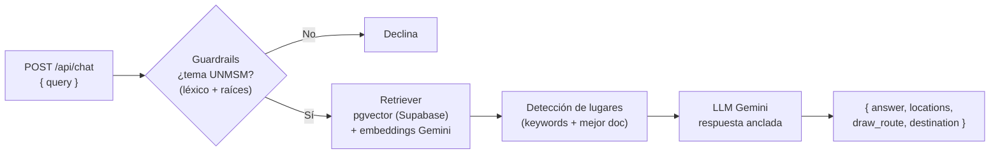

# ⚙️ Backend — OndeSanMarcos (Asistente RAG)

API del **asistente IA del campus** basada en **RAG (Retrieval-Augmented Generation)**.
Implementa el endpoint `POST /api/chat` que **ya consume el frontend** (la app apunta
por defecto al backend desplegado en Render). En **producción** corre con **LLM real
(Gemini `gemini-2.5-flash`)** sobre el **corpus oficial** del campus y **recuperación
semántica con pgvector** (Supabase + embeddings Gemini `gemini-embedding-001`, 768
dims, similitud coseno HNSW). Si Supabase no está configurado, cae con gracia a una
recuperación **local** (bag-of-words). Para desarrollo y pruebas también corre
**aislado en modo mock** (embeddings + LLM deterministas, sin llaves ni servicios
externos).

> Diseño y contexto general: ver [`/documents/03-backend-rag.md`](../documents/03-backend-rag.md).

---

## 🧩 Arquitectura

```
backend/
├── app/
│   ├── main.py            # FastAPI: /health + router del chat
│   ├── config.py          # Settings (pydantic-settings): RAG_USE_MOCK, top_k, umbral, Supabase...
│   ├── api/chat.py        # POST /api/chat  → motor RAG
│   ├── schemas/chat.py    # ChatRequest / ChatResponse / LocationResult / Coordinate
│   ├── knowledge/         # base de conocimiento
│   │   ├── places.py      #   lugares del campus (37, espejo del front)
│   │   ├── corpus.py      #   corpus oficial (41 docs, derivado de sources/unmsm_info.md)
│   │   ├── entries.py     #   entradas aprobadas (respaldo versionado del conocimiento)
│   │   ├── entries/       #   JSON de entradas (gaps_review.json)
│   │   └── sources/       #   documento oficial verificado (fuente única)
│   └── rag/               # motor RAG
│       ├── guardrails.py       #   filtro de alcance UNMSM: léxico + raíces (HU-2.4)
│       ├── intent.py           #   intención de navegación (HU-2.3)
│       ├── embeddings.py       #   mock bag-of-words + Gemini real (gemini-embedding-001)
│       ├── vector_store.py     #   almacén vectorial en memoria (coseno, usado por el mock)
│       ├── pgvector.py         #   retriever real: Supabase pgvector (RPC match_documents)
│       ├── ingestion.py        #   pipeline de ingesta (carga, troceado, embeddings)
│       ├── retriever.py        #   indexa por fragmentos + recuperación top-k
│       ├── llm.py              #   mock anclado al contexto + Gemini/OpenAI/Anthropic reales
│       ├── providers.py        #   selección de proveedores mock vs reales
│       ├── engine.py           #   orquestación del pipeline
│       ├── ingest_pgvector.py  #   ingesta a Supabase (corpus + entradas → pgvector)
│       ├── find_gaps.py        #   detecta lugares sin descripción y redacta borradores (Gemini)
│       └── upload_entries.py   #   sube entradas aprobadas a Supabase
└── tests/                 # pytest (76): guardrails, retriever, ingesta, pgvector, proveedores, motor, enrutamiento, entradas, endpoint
```

Pipeline de una consulta:



> Sin Supabase configurado, el `Retriever` local (bag-of-words) sustituye al paso
> de pgvector; en modo mock todo el pipeline es determinista (sin red).

---

## 🚀 Puesta en marcha

Requiere **Python 3.11+**.

```bash
cd backend
python -m venv .venv
.venv\Scripts\activate          # Windows  (en Linux/Mac: source .venv/bin/activate)
pip install -r requirements.txt

# Configuración (opcional: por defecto ya corre en modo mock)
copy .env.example .env          # Windows  (Linux/Mac: cp .env.example .env)
```

### Ejecutar la API

```bash
uvicorn app.main:app --reload
```

- Healthcheck: http://localhost:8000/health
- Documentación interactiva (Swagger): http://localhost:8000/docs

### Probar el endpoint

```bash
curl -X POST http://localhost:8000/api/chat ^
  -H "Content-Type: application/json" ^
  -d "{\"query\": \"horario de la biblioteca\"}"
```

Respuesta:

```json
{
  "answer": "La Biblioteca Central Pedro Zulen abre de lunes a viernes de 7:30 a 20:00 y los sábados de 8:00 a 17:00. Toca \"Ver en mapa\" para ubicarlo.",
  "locations": [
    { "id": "biblioteca-central", "name": "Biblioteca Central Pedro Zulen", "schedule": "Lun–Sáb 8:00–20:00 · Requiere carné de biblioteca · Tel: 619-7000 anexo 7701" }
  ],
  "draw_route": false,
  "destination": null
}
```

### Ejecutar las pruebas

```bash
pytest
```

---

## 🔌 Contrato del chat

| Método | Ruta | Body | Respuesta |
|--------|------|------|-----------|
| `POST` | `/api/chat` | `{ "query": string }` | `{ "answer", "locations": LocationResult[], "draw_route": bool, "destination": Coordinate? }` |
| `GET`  | `/health` | — | `{ "status": "ok", ... }` |

`LocationResult = { id, name, schedule? }` · `Coordinate = { latitude, longitude }`.
Para consultas de navegación ("cómo llego a…"), `draw_route` es `true` y
`destination` trae las coordenadas del lugar (HU-2.3). El **frontend ya consume este
endpoint por defecto** (apunta al backend de Render; el mock del chat solo se activa
con `EXPO_PUBLIC_USE_MOCK_CHAT=true`).

---

## 🔁 Modo mock vs. proveedores reales

Controlado por `RAG_USE_MOCK` (ver `.env.example`):

| | Modo mock (`true`, tests/local) | Modo real (`false`, **producción**) |
|---|---|---|
| Embeddings | `BagOfWordsEmbedding` (sin deps) | **Gemini** `gemini-embedding-001` (768 dims) *(activo)* |
| LLM | `TemplateLLM` (anclado al contexto) | **Gemini** `gemini-2.5-flash` (u OpenAI/Anthropic) *(activo)* |
| Recuperación | en memoria (bag-of-words) | **Supabase + `pgvector`** (coseno HNSW) *(activo)* · local si falta Supabase |
| Requisitos | `requirements.txt` | + `requirements-llm.txt` (Gemini) + `requirements-pgvector.txt` (Supabase); `LLM_API_KEY` y `SUPABASE_*` |

La selección de implementaciones vive en `app/rag/providers.py` (la usa
`engine.build_engine`). Si en modo real falta una llave o dependencia, se lanza
`RagProviderError` y el endpoint responde **503** con instrucciones. Guía
completa de activación en
[`/documents/07-avance-backend.md`](../documents/07-avance-backend.md).
