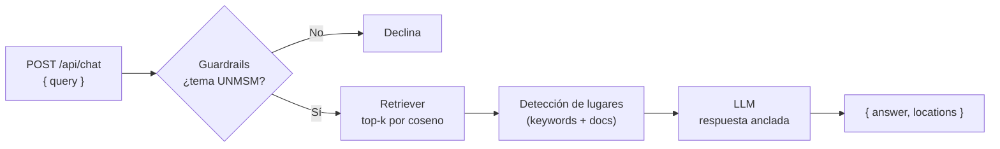

# ⚙️ Backend — OndeSanMarcos (Asistente RAG)

API del **asistente IA del campus** basada en **RAG (Retrieval-Augmented Generation)**.
Implementa el endpoint `POST /api/chat` que ya espera el frontend, pero **funciona de
forma totalmente aislada**: el motor RAG corre en *modo mock* (embeddings + LLM
deterministas, sin llaves ni servicios externos), por lo que se puede desarrollar y
probar sin el frontend ni un LLM real.

> Diseño y contexto general: ver [`/documents/03-backend-rag.md`](../documents/03-backend-rag.md).

---

## 🧩 Arquitectura

```
backend/
├── app/
│   ├── main.py            # FastAPI: /health + router del chat
│   ├── config.py          # Settings (pydantic-settings): RAG_USE_MOCK, top_k, umbral...
│   ├── api/chat.py        # POST /api/chat  → motor RAG
│   ├── schemas/chat.py    # ChatRequest / ChatResponse / LocationResult / Coordinate
│   ├── knowledge/         # base de conocimiento
│   │   ├── places.py      #   lugares del campus (espejo del front)
│   │   └── corpus.py      #   documentos institucionales de ejemplo
│   └── rag/               # motor RAG
│       ├── guardrails.py  #   filtro de alcance UNMSM (HU-2.4)
│       ├── intent.py      #   intención de navegación (HU-2.3)
│       ├── embeddings.py  #   vectorizador mock (bag-of-words)
│       ├── vector_store.py#   almacén vectorial en memoria (coseno)
│       ├── ingestion.py   #   pipeline de ingesta (carga, troceado, embeddings)
│       ├── retriever.py   #   indexa por fragmentos + recuperación top-k
│       ├── llm.py         #   mock anclado al contexto + OpenAI/Anthropic reales
│       ├── providers.py   #   selección de proveedores mock vs reales
│       └── engine.py      #   orquestación del pipeline
└── tests/                 # pytest (37): guardrails, retriever, ingesta, proveedores, motor, enrutamiento, endpoint
```

Pipeline de una consulta:



---

## 🚀 Puesta en marcha

Requiere **Python 3.11+**.

```bash
cd backend
python -m venv .venv
.venv\Scripts\activate          # Windows  (en Linux/Mac: source .venv/bin/activate)
pip install -r requirements.txt

# Configuración (opcional: por defecto ya corre en modo mock)
copy .env.example .env          # Windows  (Linux/Mac: cp .env.example .env)
```

### Ejecutar la API

```bash
uvicorn app.main:app --reload
```

- Healthcheck: http://localhost:8000/health
- Documentación interactiva (Swagger): http://localhost:8000/docs

### Probar el endpoint

```bash
curl -X POST http://localhost:8000/api/chat ^
  -H "Content-Type: application/json" ^
  -d "{\"query\": \"horario de la biblioteca\"}"
```

Respuesta:

```json
{
  "answer": "La Biblioteca Central Pedro Zulen brinda servicios... Toca \"Ver en mapa\" para ubicarlo.",
  "locations": [
    { "id": "biblioteca-central", "name": "Biblioteca Central Pedro Zulen", "schedule": "Lun–Sáb 8:00–21:00" }
  ]
}
```

### Ejecutar las pruebas

```bash
pytest
```

---

## 🔌 Contrato del chat

| Método | Ruta | Body | Respuesta |
|--------|------|------|-----------|
| `POST` | `/api/chat` | `{ "query": string }` | `{ "answer", "locations": LocationResult[], "draw_route": bool, "destination": Coordinate? }` |
| `GET`  | `/health` | — | `{ "status": "ok", ... }` |

`LocationResult = { id, name, schedule? }` · `Coordinate = { latitude, longitude }`.
Para consultas de navegación ("cómo llego a…"), `draw_route` es `true` y
`destination` trae las coordenadas del lugar (HU-2.3). **Aún no se conecta** el
frontend: el cliente puede apuntar aquí cuando se decida (apagando su modo mock).

---

## 🔁 Modo mock vs. proveedores reales

Controlado por `RAG_USE_MOCK` (ver `.env.example`):

| | Modo mock (`true`, por defecto) | Modo real (`false`) |
|---|---|---|
| Embeddings | `BagOfWordsEmbedding` (sin deps) | modelo real vía LlamaIndex *(pendiente)* |
| LLM | `TemplateLLM` (anclado al contexto) | OpenAI / Anthropic *(implementado)* |
| Vector store | en memoria | Supabase + `pgvector` *(pendiente)* |
| Requisitos | `requirements.txt` | + `requirements-rag.txt` y llaves |

La selección de implementaciones vive en `app/rag/providers.py` (la usa
`engine.build_engine`). Si en modo real falta una llave o dependencia, se lanza
`RagProviderError` y el endpoint responde **503** con instrucciones. Guía
completa de activación en
[`/documents/07-avance-backend.md`](../documents/07-avance-backend.md).
