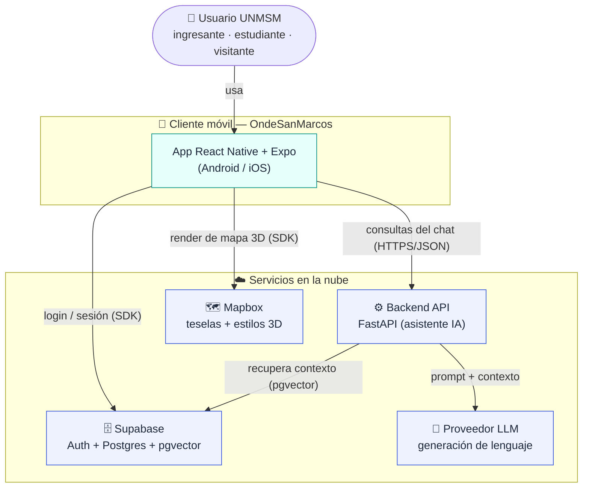
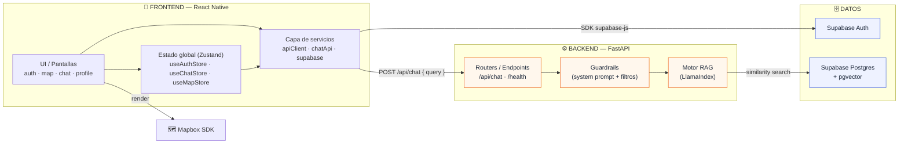
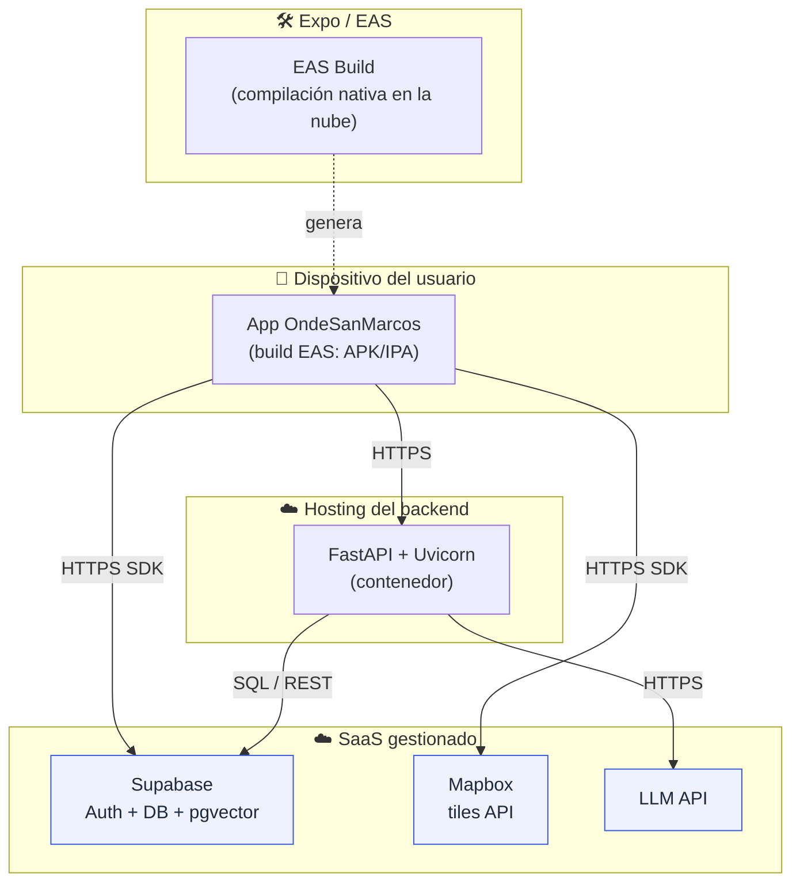
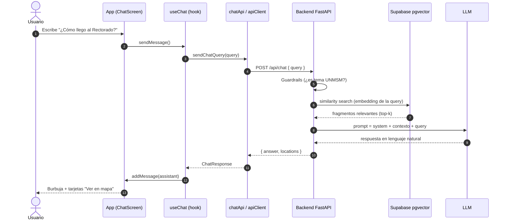

# 1. Arquitectura general

Este documento describe la arquitectura de **OndeSanMarcos** de extremo a extremo: qué piezas existen, **cómo se conecta el frontend con el backend**, qué servicios viven en cada lado y cómo se despliega todo.

---

## 1.1 Visión de alto nivel (diagrama de contexto)

El sistema tiene un **cliente móvil** (React Native) que se comunica con tres proveedores externos: **Supabase** (autenticación + base de conocimiento), el **Backend propio** (asistente IA) y **Mapbox** (mapas). El backend, a su vez, consume un **proveedor LLM** para generar las respuestas del asistente.



> **Nota de estado:** hoy el cliente funciona en **modo mock** (`EXPO_PUBLIC_USE_MOCK_CHAT` por defecto `true`): el chat responde localmente sin llamar al backend. El backend y el LLM están **planificados**; este diagrama representa la arquitectura objetivo.

---

## 1.2 Arquitectura por capas (frontend ↔ backend)

Vista de "contenedores": los módulos internos de cada lado y el **contrato** que los une (`POST /api/chat`).



### Servicios en cada lado

| Lado | Servicio / Módulo | Responsabilidad | Estado |
|------|-------------------|-----------------|--------|
| **Frontend** | `services/supabase/auth.service` | signUp, signIn, signOut, sesión, listener de auth. | ✅ |
| **Frontend** | `services/supabase/client` | Cliente Supabase con persistencia en AsyncStorage. | ✅ |
| **Frontend** | `services/api/client` (`apiClient`) | Wrapper `fetch` genérico (GET/POST, JSON, errores). | ✅ |
| **Frontend** | `services/api/chatApi` (`sendChatQuery`) | Llama `POST /api/chat` con `{ query }`. | ✅ (a la espera del backend) |
| **Backend** | Router `/api/chat` | Recibe la consulta, orquesta RAG, responde `{ answer, locations }`. | 🟠 |
| **Backend** | Guardrails | Limita el alcance a temas UNMSM (HU-2.4). | 🟠 |
| **Backend** | Motor RAG (LlamaIndex) | Recupera fragmentos relevantes y genera la respuesta. | 🟠 |
| **Datos** | Supabase Auth | Usuarios, verificación por correo, sesiones JWT. | ✅ |
| **Datos** | Supabase Postgres + `pgvector` | Documentos institucionales + embeddings. | 🟠 |

---

## 1.3 El contrato Frontend ↔ Backend

La frontera entre app y backend es **un único endpoint HTTP** hoy por hoy. El cliente ya está preparado para consumirlo (`chatApi.ts`); cuando el backend exista, basta con apagar el modo mock.

**Petición**

```http
POST {EXPO_PUBLIC_API_URL}/api/chat
Content-Type: application/json

{ "query": "¿Cómo llego al Rectorado?" }
```

**Respuesta esperada** (tipada en el front como `ChatResponse`)

```jsonc
{
  "answer": "El Rectorado está en la zona central del campus...",
  "locations": [
    { "id": "rectorado", "name": "Rectorado", "schedule": "Lun–Vie 8:00–17:00" }
  ]
}
```

> **Evolución prevista (HU-2.3):** la respuesta incorporará un flag `draw_route` y coordenadas para que el frontend cambie automáticamente a la pestaña del Mapa y trace la ruta. Ver [05-flujos](./05-flujos.md#54-enrutamiento-automático-chat--mapa).

---

## 1.4 Diagrama de despliegue

Dónde corre cada componente en producción.



**Notas de despliegue**
- La app se compila con **EAS Build** (`eas.json`, `projectId` en `app.config.ts`) porque `@rnmapbox/maps` incluye código nativo y **no funciona en Expo Go**.
- La configuración sensible viaja por **variables de entorno** `EXPO_PUBLIC_*` (ver [02-frontend §2.6](./02-frontend.md#26-configuración-y-variables-de-entorno)).
- El backend es un servicio HTTP independiente; puede desplegarse en cualquier host de contenedores.

---

## 1.5 Ciclo de vida de una consulta (extremo a extremo)

Cómo viaja una pregunta del usuario por toda la pila en la arquitectura objetivo (con backend real):



> En **modo mock** los pasos 4–11 se reemplazan por `mockChatQuery()`, que empareja la consulta contra `CAMPUS_PLACES` localmente. Ver [05-flujos §5.3](./05-flujos.md#53-conversación-con-el-asistente).

---

## 1.6 Decisiones de arquitectura (resumen)

| Decisión | Motivo |
|----------|--------|
| **Arquitectura por features** en el front | Escala por dominio (auth/map/chat) y aísla responsabilidades. |
| **Zustand** en vez de Redux | Mínimo boilerplate; selectores simples; persistencia con middleware. |
| **Supabase como BaaS** | Auth + Postgres + `pgvector` en un solo servicio con tier gratuito. |
| **RAG con LlamaIndex** | Respuestas ancladas a documentos oficiales → evita alucinaciones (HU-2.2). |
| **Backend separado para el LLM** | Oculta llaves del LLM y centraliza guardrails fuera del cliente. |
| **Modo mock conmutable** | Permite avanzar la UI del chat sin depender del backend. |
