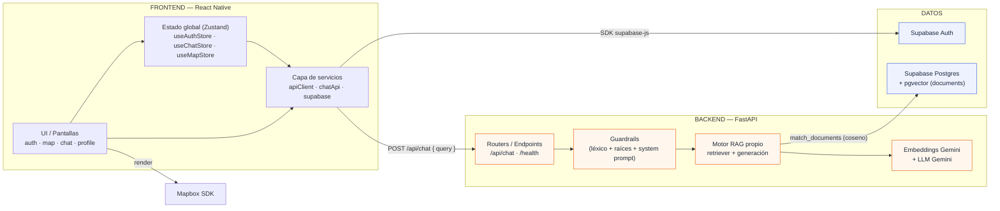
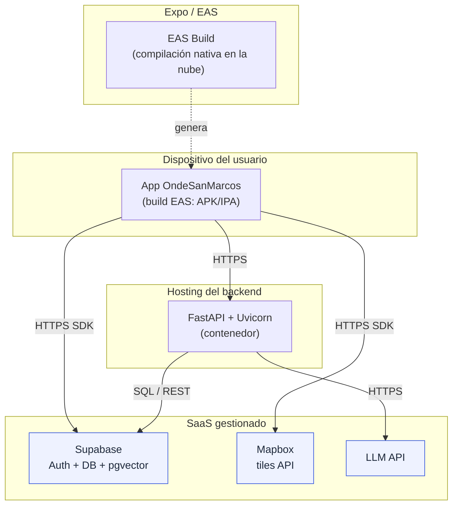
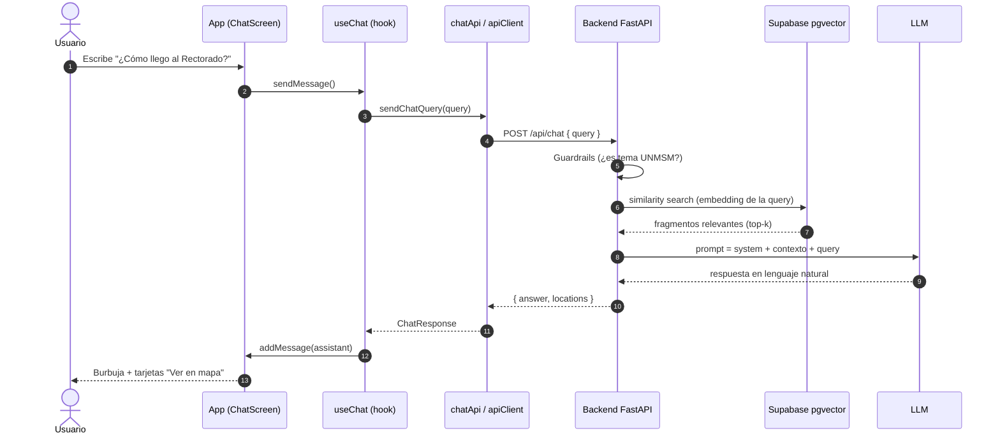
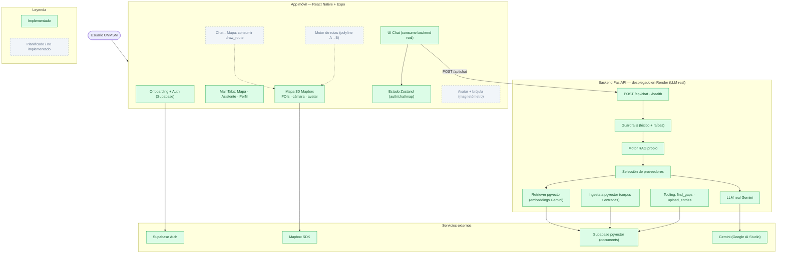

# 1. Arquitectura general

Este documento describe la arquitectura de **OndeSanMarcos** de extremo a extremo: qué piezas existen, **cómo se conecta el frontend con el backend**, qué servicios viven en cada lado y cómo se despliega todo.

---

## 1.1 Visión de alto nivel (diagrama de contexto)

El sistema tiene un **cliente móvil** (React Native) que se comunica con tres proveedores externos: **Supabase** (autenticación + base de conocimiento), el **Backend propio** (asistente IA) y **Mapbox** (mapas). El backend, a su vez, consume un **proveedor LLM** para generar las respuestas del asistente.


> **Nota de estado:** este diagrama ya es el estado **real**. El backend está **desplegado en Render** con **LLM real (Gemini)** y **recuperación semántica con Supabase pgvector** (embeddings Gemini). El **cliente consume el backend por defecto** (`Config.api.baseUrl` → URL de Render; el mock del chat solo se fuerza con `EXPO_PUBLIC_USE_MOCK_CHAT=true`). Ver [§1.7](#17-vista-completa-implementado-vs-planificado) y [07-avance-backend](./07-avance-backend.md).

---

## 1.2 Arquitectura por capas (frontend ↔ backend)

Vista de "contenedores": los módulos internos de cada lado y el **contrato** que los une (`POST /api/chat`).



### Servicios en cada lado

| Lado         | Servicio / Módulo                        | Responsabilidad                                                     | Estado                       |
| ------------ | ---------------------------------------- | ------------------------------------------------------------------- | ---------------------------- |
| **Frontend** | `services/supabase/auth.service`         | signUp, signIn, signOut, sesión, listener de auth.                  | ✅                           |
| **Frontend** | `services/supabase/client`               | Cliente Supabase con persistencia en AsyncStorage.                  | ✅                           |
| **Frontend** | `services/api/client` (`apiClient`)      | Wrapper `fetch` genérico (GET/POST, JSON, errores).                 | ✅                           |
| **Frontend** | `services/api/chatApi` (`sendChatQuery`) | Llama `POST /api/chat` con `{ query }`.                             | ✅ (consume el backend real) |
| **Backend**  | Router `/api/chat`                       | Recibe la consulta, orquesta RAG, responde `{ answer, locations, draw_route, destination }`. | ✅                 |
| **Backend**  | Guardrails                               | Limita el alcance a temas UNMSM (HU-2.4).                           | ✅                           |
| **Backend**  | Motor RAG propio                         | Recupera fragmentos relevantes (pgvector) y genera la respuesta (Gemini). | ✅                    |
| **Datos**    | Supabase Auth                            | Usuarios, verificación por correo, sesiones JWT.                    | ✅                           |
| **Datos**    | Supabase Postgres + `pgvector`           | Documentos institucionales + embeddings Gemini (tabla `documents`). | ✅                          |

---

## 1.3 El contrato Frontend ↔ Backend

La frontera entre app y backend es **un único endpoint HTTP**. El cliente ya lo consume (`chatApi.ts`) apuntando por defecto al backend desplegado en Render; el modo mock del chat solo se activa manualmente (`EXPO_PUBLIC_USE_MOCK_CHAT=true`).

**Petición**

```http
POST {EXPO_PUBLIC_API_URL}/api/chat
Content-Type: application/json

{ "query": "¿Cómo llego al Rectorado?" }
```

**Respuesta esperada** (tipada en el front como `ChatResponse`)

```jsonc
{
  "answer": "El Rectorado está en la zona central del campus...",
  "locations": [
    {
      "id": "rectorado",
      "name": "Rectorado",
      "schedule": "Lun–Vie 8:00–17:00",
    },
  ],
}
```

> **Enrutamiento (HU-2.3):** la respuesta ya incorpora el flag `draw_route` y las coordenadas `destination` para las consultas de navegación. Falta que el **frontend** las consuma para cambiar a la pestaña del Mapa y trazar la ruta automáticamente. Ver [05-flujos](./05-flujos.md#54-enrutamiento-automático-chat--mapa).

---

## 1.4 Diagrama de despliegue

Dónde corre cada componente en producción.



**Notas de despliegue**

- La app se compila con **EAS Build** (`eas.json`, `projectId` en `app.config.ts`) porque `@rnmapbox/maps` incluye código nativo y **no funciona en Expo Go**.
- La configuración sensible viaja por **variables de entorno** `EXPO_PUBLIC_*` (ver [02-frontend §2.6](./02-frontend.md#26-configuración-y-variables-de-entorno)).
- El backend es un servicio HTTP independiente; puede desplegarse en cualquier host de contenedores.

---

## 1.5 Ciclo de vida de una consulta (extremo a extremo)

Cómo viaja una pregunta del usuario por toda la pila en la arquitectura objetivo (con backend real):



> En **modo mock** los pasos 4–11 se reemplazan por `mockChatQuery()`, que empareja la consulta contra `CAMPUS_PLACES` localmente. Ver [05-flujos §5.3](./05-flujos.md#53-conversación-con-el-asistente).

---

## 1.6 Decisiones de arquitectura (resumen)

| Decisión                                  | Motivo                                                                     |
| ----------------------------------------- | -------------------------------------------------------------------------- |
| **Arquitectura por features** en el front | Escala por dominio (auth/map/chat) y aísla responsabilidades.              |
| **Zustand** en vez de Redux               | Mínimo boilerplate; selectores simples; persistencia con middleware.       |
| **Supabase como BaaS**                    | Auth + Postgres + `pgvector` en un solo servicio con tier gratuito.        |
| **RAG con motor propio + pgvector**       | Respuestas ancladas a documentos oficiales → evita alucinaciones (HU-2.2). |
| **Backend separado para el LLM**          | Oculta llaves del LLM y centraliza guardrails fuera del cliente.           |
| **Modo mock conmutable**                  | Permite avanzar la UI del chat sin depender del backend.                   |

---

## 1.7 Vista completa: implementado vs. planificado

Una sola vista de todo el sistema (app móvil + backend + servicios externos) con
el **estado real de cada componente**. Verde sólido = implementado; gris punteado
= planificado / no implementado todavía.



> El backend está completo y en producción (LLM real Gemini + recuperación con
> pgvector). Lo punteado que resta es del **frontend/mapa**: consumir el
> enrutamiento (`draw_route`) en el mapa, el motor de rutas y los sensores del
> avatar. Estado por historia en [06-backlog-y-roadmap §6.3](./06-backlog-y-roadmap.md#63-historias-de-usuario-y-estado).
