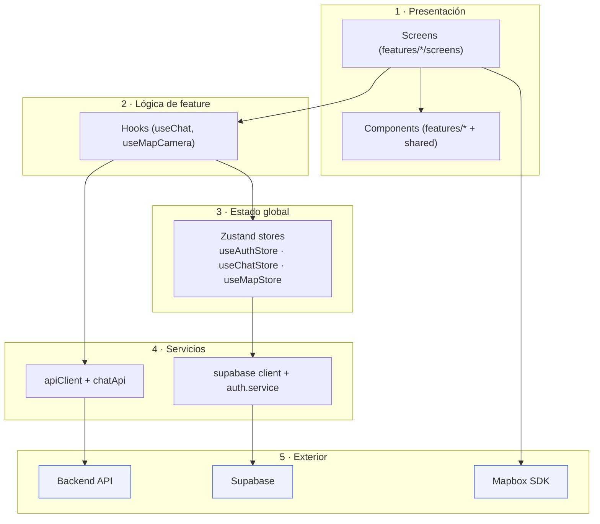
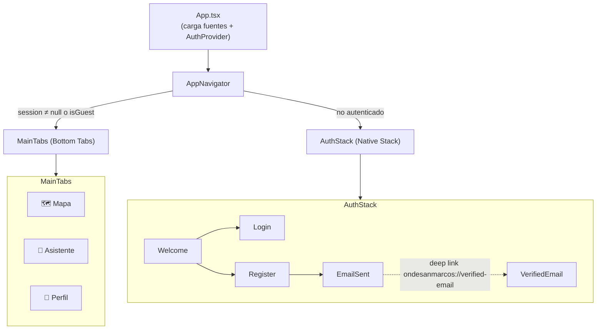
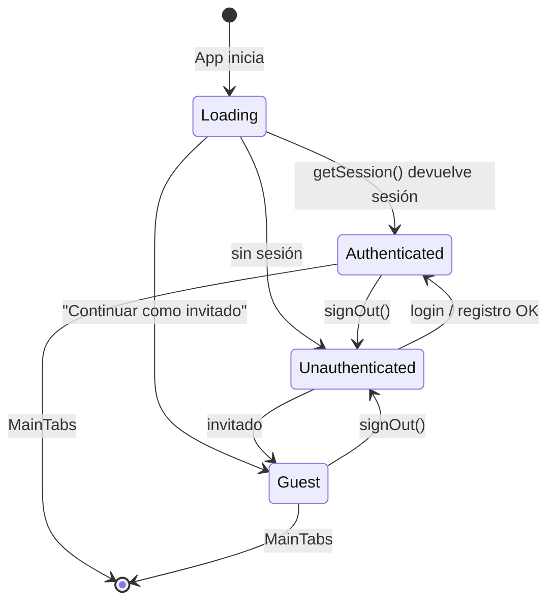
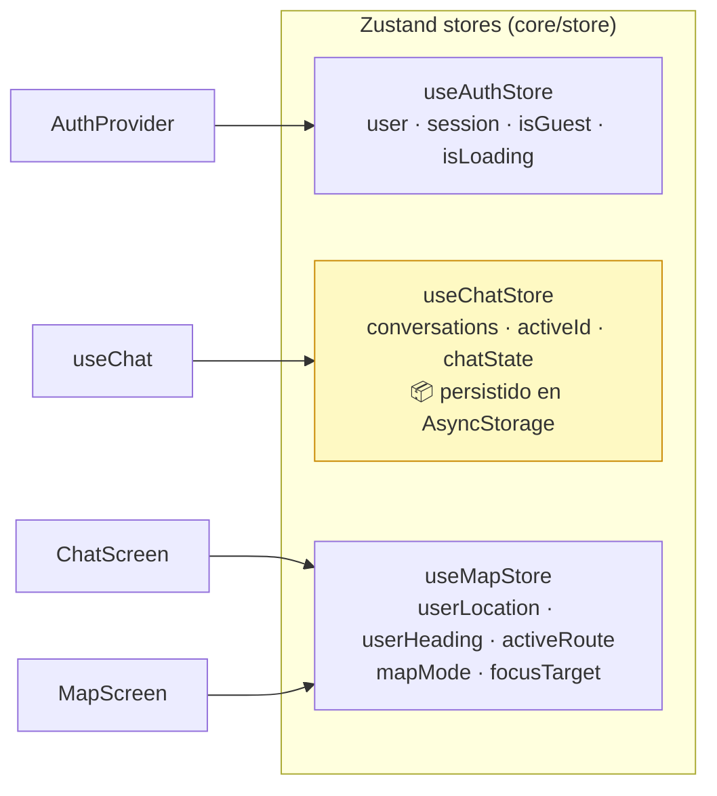
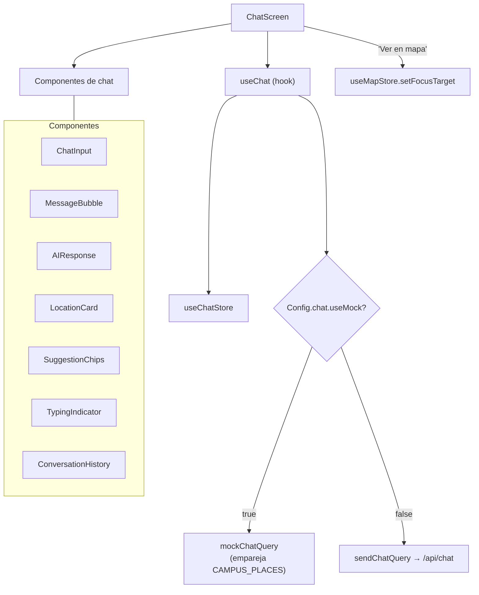
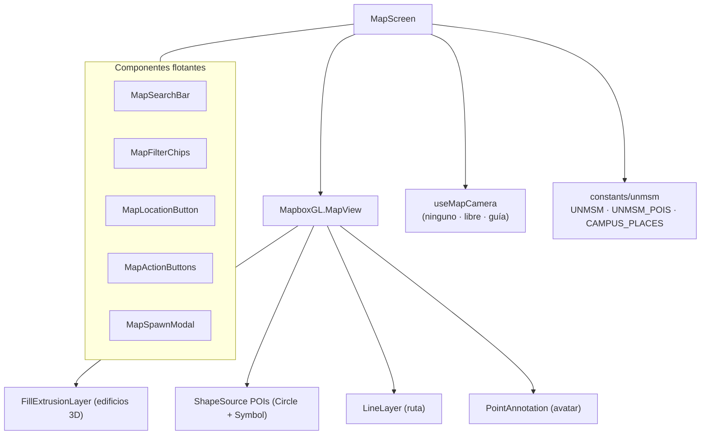

# 2. Frontend (React Native)

App móvil construida con **React Native + Expo + TypeScript**, organizada por **features** (dominios) con capas compartidas (`core`, `services`, `shared`).

---

## 2.1 Estructura de carpetas

```
frontend/src/
├── constants/            # Tokens globales: colores, tipografía, Config (env)
│   ├── colors.ts
│   ├── config.ts         # ← lee variables EXPO_PUBLIC_* (api, mapbox, supabase, mock)
│   └── typography.ts
├── core/                 # Núcleo transversal de la app
│   ├── navigation/       # AppNavigator, AuthStack, MainTabs, types
│   ├── providers/        # AuthProvider (bootstrap de sesión)
│   └── store/            # Zustand: useAuthStore, useChatStore, useMapStore
├── features/             # Dominios funcionales (uno por carpeta)
│   ├── auth/             # Welcome, Login, Register, EmailSent, VerifiedEmail
│   ├── chat/             # Asistente IA: components, hooks, constants, screens, types
│   ├── map/              # Mapa 3D: components, hooks, constants, screens
│   ├── profile/          # Perfil y ajustes
│   └── routing/          # Motor de rutas (vacío — planificado)
├── services/             # Acceso a sistemas externos
│   ├── api/              # client (fetch), chatApi
│   └── supabase/         # client, auth.service
├── shared/               # Reutilizable entre features
│   ├── assets/           # SVGs de ilustraciones
│   ├── components/       # Button, Input, AuthHeader, StepDots, SettingsItem...
│   ├── hooks/
│   └── utils/
├── theme/                # light / dark / colors (tematización)
└── types/                # Declaraciones globales (svg.d.ts)
```

**Convención:** cada feature agrupa su propio `components/`, `hooks/`, `constants/`, `screens/` y `types/`. Lo que se comparte entre features sube a `shared/` o `core/`.

---

## 2.2 Arquitectura por capas

El flujo de dependencias va de **UI → estado → servicios → exterior**. La UI nunca llama directamente a la red: pasa por la capa de servicios.



---

## 2.3 Navegación

La app arranca en `App.tsx`, que envuelve todo en `AuthProvider` y monta `AppNavigator`. El navegador raíz **decide entre dos mundos** según el estado de autenticación.



- **`AuthStack`** (`@react-navigation/native-stack`): Welcome → Login / Register → EmailSent → VerifiedEmail.
- **`MainTabs`** (`@react-navigation/bottom-tabs`): Mapa, Asistente, Perfil.
- **Deep linking**: esquema `ondesanmarcos://` mapeado en `AppNavigator` (clave para la verificación de correo, que vuelve a la app desde el enlace del email).

### Gating de autenticación (máquina de estados)



> `isLoading` arranca en `true`; mientras dura, `AppNavigator` renderiza `null` (evita parpadeo). `AuthProvider` resuelve `getSession()` y se suscribe a `onAuthStateChange`.

---

## 2.4 Gestión de estado (Zustand)

Tres stores independientes, cada uno dueño de su dominio:



| Store | Persistencia | Notas |
|-------|--------------|-------|
| `useAuthStore` | No | Reflejo de la sesión de Supabase; se rehidrata vía `getSession()`. |
| `useChatStore` | **Sí** (AsyncStorage, clave `osm-chat-conversations`) | `partialize` guarda solo `conversations`; el resto es estado de sesión. |
| `useMapStore` | No | `focusTarget` permite que el chat centre el mapa en un lugar. |

Detalle de campos y acciones en [04-modelo-de-datos](./04-modelo-de-datos.md).

---

## 2.5 Composición de los features clave

### Feature `chat`



- `useChat` orquesta el ciclo idle → asking → answered, agrega mensajes y maneja errores con botón **Reintentar**.
- `LocationCard` dispara `handleOpenLocation` → `setFocusTarget(coordenada)` → `navigation.navigate('Map')`.

### Feature `map`



- `useMapCamera` controla la cámara: **modo ninguno** (vista pájaro), **modo libre** (inmersión tipo street view) y navegación punto a punto.
- POIs se filtran por `categoria` mediante `MapFilterChips`.

> ⚠️ **Brecha actual:** `ChatScreen` ya escribe `focusTarget` en `useMapStore`, pero el `MapScreen` vigente (rediseño 3D) **aún no lee** `focusTarget` para recentrarse. Cerrar este enlace es el siguiente paso de la integración Chat→Mapa.

---

## 2.6 Configuración y variables de entorno

Toda la configuración se centraliza en `src/constants/config.ts`, que lee variables `EXPO_PUBLIC_*` (ver `.env.example`):

| Variable | Uso | Default |
|----------|-----|---------|
| `EXPO_PUBLIC_API_URL` | Base del backend (`apiClient`). | `http://localhost:8000` |
| `EXPO_PUBLIC_MAPBOX_TOKEN` | Token público de Mapbox. | `''` |
| `EXPO_PUBLIC_SUPABASE_URL` | URL del proyecto Supabase. | `''` |
| `EXPO_PUBLIC_SUPABASE_ANON_KEY` | Llave anónima de Supabase. | `''` |
| `EXPO_PUBLIC_USE_MOCK_CHAT` | Si `≠ 'false'`, el chat usa respuestas mock. | mock activo |
| `EXPO_PUBLIC_ENABLE_DEV_LOGS` | Logs de desarrollo. | `false` |

Además, `app.config.ts` expone `mapboxPublicToken` y el `projectId` de EAS vía `expo.extra`.

> **Alias de imports** (definidos en `babel.config.js` / `tsconfig.json`): `@features/*`, `@store/*`, `@services/*`, `@constants/*`, `@navigation/*`, `@providers/*`, `@/theme/*`. Por eso se ve `import { useChat } from '@features/chat/hooks/useChat'`.
