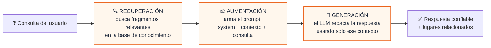
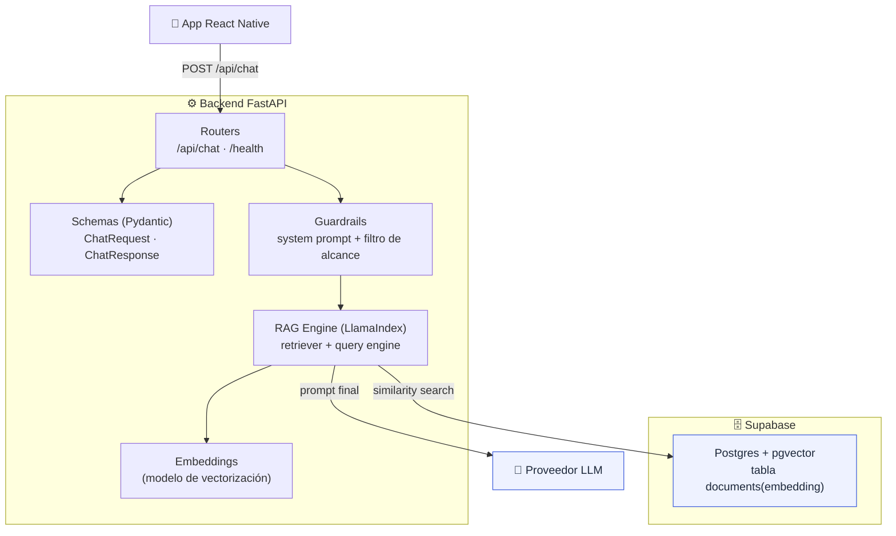
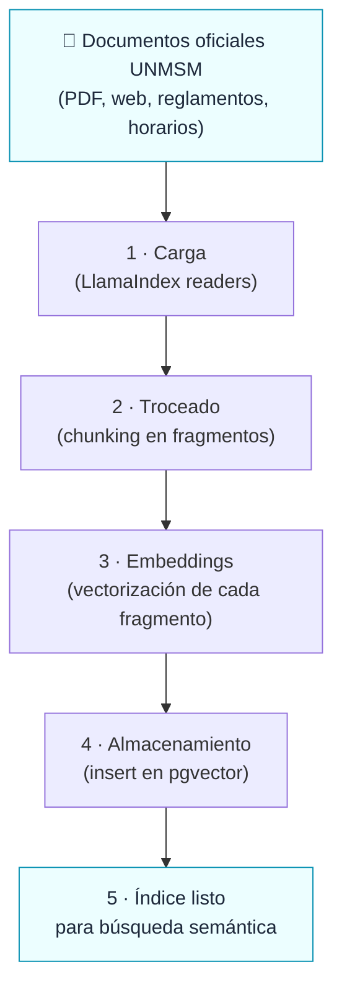
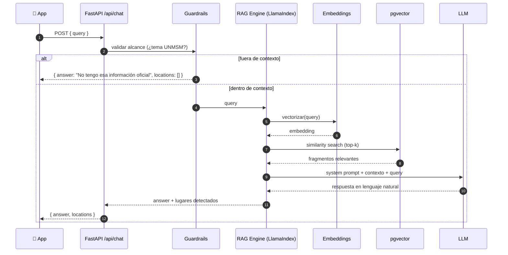
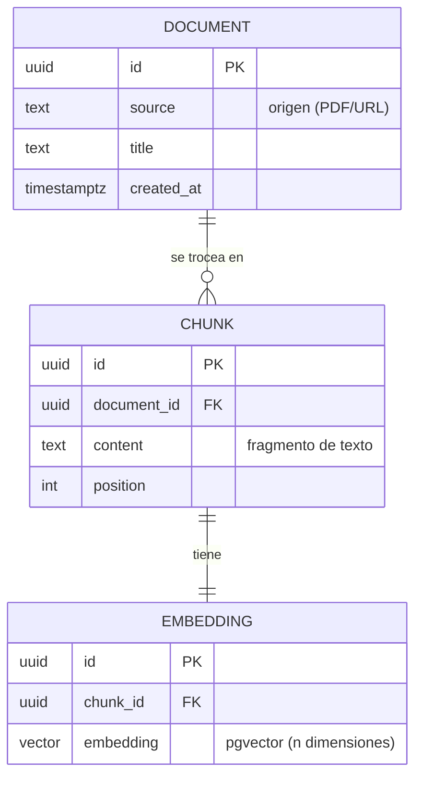
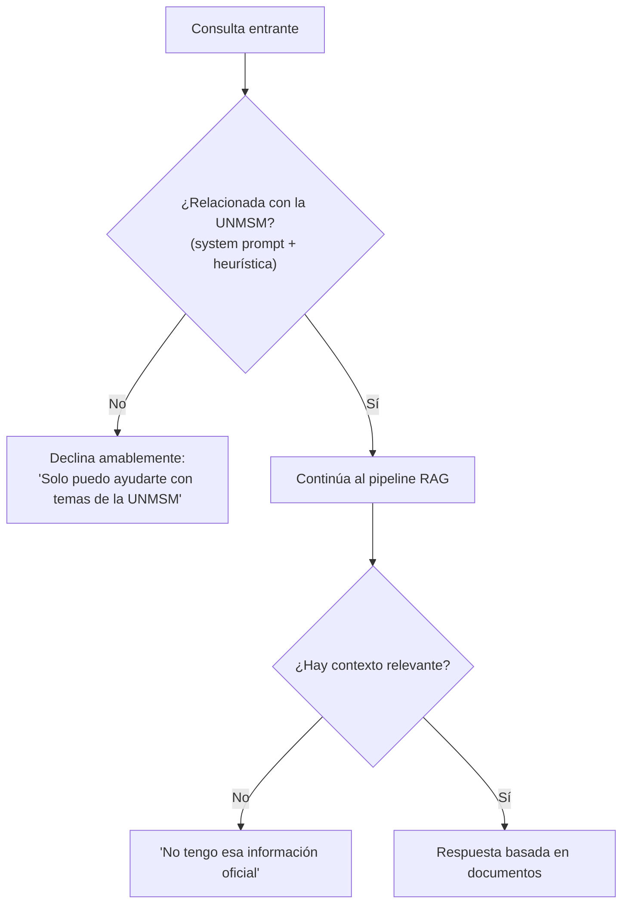

# 3. Backend y RAG

> **Estado:** el backend está **planificado**. Hoy solo existe `backend/requirements.txt` con las dependencias base (`fastapi`, `uvicorn`, `supabase`, `llama-index`). Este documento define la **arquitectura objetivo** del asistente IA para que sea fácil de visualizar y construir.

El asistente responde **solo con información oficial de la UNMSM**. Para lograrlo se usa **RAG (Retrieval-Augmented Generation)**: en vez de dejar que el modelo "invente", primero se **recuperan** fragmentos de documentos institucionales y luego se le pide al LLM que **genere** la respuesta usando ese contexto.

---

## 3.1 ¿Por qué RAG?

| Problema sin RAG | Solución con RAG |
|------------------|------------------|
| El LLM alucina datos (horarios, oficinas inexistentes). | Las respuestas se anclan a documentos reales (HU-2.2). |
| El conocimiento del modelo está congelado. | Se actualiza agregando documentos a la base vectorial. |
| No hay forma de citar la fuente. | Cada respuesta se construye desde fragmentos recuperados. |



---

## 3.2 Arquitectura del backend (FastAPI)



| Componente | Responsabilidad |
|------------|-----------------|
| **Routers** | Exponen los endpoints HTTP (`/api/chat`, `/health`). |
| **Schemas (Pydantic)** | Validan y tipan request/response. |
| **Guardrails** | Aplican el *system prompt* y descartan consultas fuera del dominio UNMSM (HU-2.4). |
| **RAG Engine (LlamaIndex)** | Recupera contexto y coordina la llamada al LLM. |
| **Embeddings** | Convierten texto en vectores para la búsqueda semántica. |
| **pgvector** | Almacena e indexa los embeddings de los documentos. |

---

## 3.3 Pipeline de ingesta (offline)

Proceso **previo y periódico** que alimenta la base de conocimiento. No ocurre durante la conversación.



> Agregar nueva información institucional = volver a correr la ingesta con los documentos nuevos. La app no cambia (objetivo de negocio del [Product Vision Board](./06-backlog-y-roadmap.md)).

---

## 3.4 Pipeline de consulta (online, en cada pregunta)



---

## 3.5 Modelo de datos de la base de conocimiento (pgvector)

Esquema mínimo propuesto para Supabase:



> En la práctica con LlamaIndex + Supabase suele usarse **una sola tabla** (p. ej. `documents`) con columnas `content`, `metadata (jsonb)` y `embedding (vector)`. El diagrama anterior muestra el modelo conceptual; la implementación puede aplanarlo.

---

## 3.6 Guardrails (HU-2.4)

Para evitar el uso indebido de la API del LLM, el backend restringe el alcance del asistente:



---

## 3.7 Contrato de la API

| Método | Ruta | Body | Respuesta |
|--------|------|------|-----------|
| `POST` | `/api/chat` | `{ "query": string }` | `{ "answer": string, "locations": LocationResult[] }` |
| `GET`  | `/health` | — | `{ "status": "ok" }` |

`LocationResult` (compartido con el frontend, ver [04-modelo-de-datos](./04-modelo-de-datos.md)):

```ts
interface LocationResult {
  id: string;        // ej. "rectorado"
  name: string;      // ej. "Rectorado"
  schedule?: string; // ej. "Lun–Vie 8:00–17:00"
}
```

### Evolución (HU-2.3 — enrutamiento automático)

La respuesta crecerá para soportar el dibujo automático de rutas:

```jsonc
{
  "answer": "Te llevo al Rectorado.",
  "locations": [ { "id": "rectorado", "name": "Rectorado" } ],
  "draw_route": true,
  "destination": { "latitude": -12.0578, "longitude": -77.084 }
}
```

El frontend detectará `draw_route` para cambiar a la pestaña Mapa y trazar el camino. Ver [05-flujos §5.4](./05-flujos.md#54-enrutamiento-automático-chat--mapa).

---

## 3.8 Cómo levantar el backend (referencia)

```bash
cd backend
python -m venv venv
venv\Scripts\activate        # Windows
pip install -r requirements.txt
uvicorn main:app --reload    # cuando exista main.py
```

> Variables sensibles (URL de Supabase, llave de servicio, API key del LLM) deben ir en variables de entorno del backend, **nunca** en el cliente móvil.
