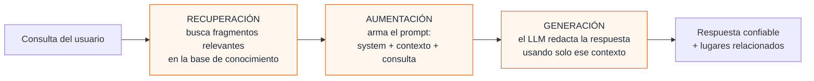
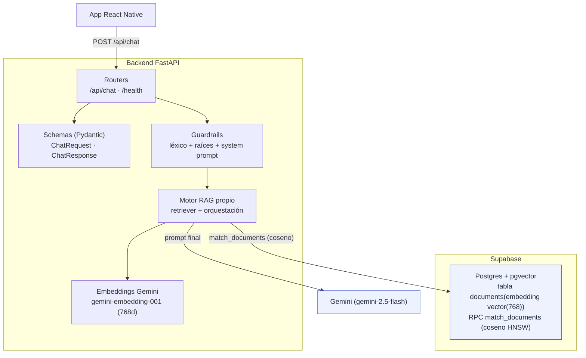
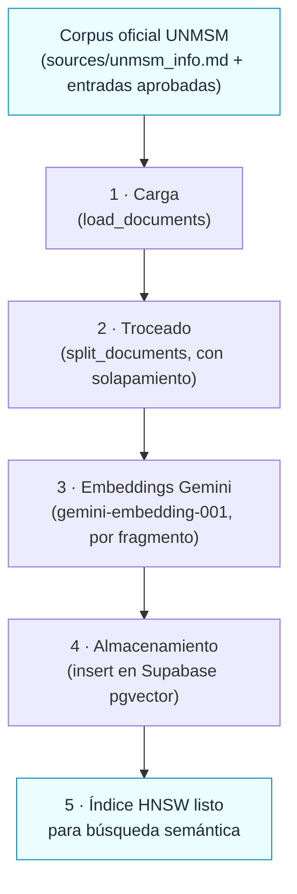
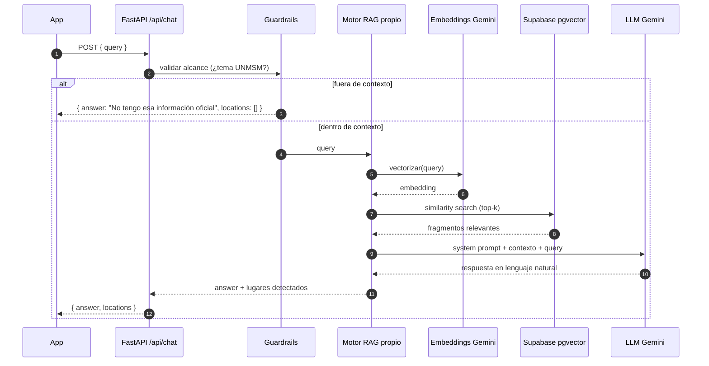
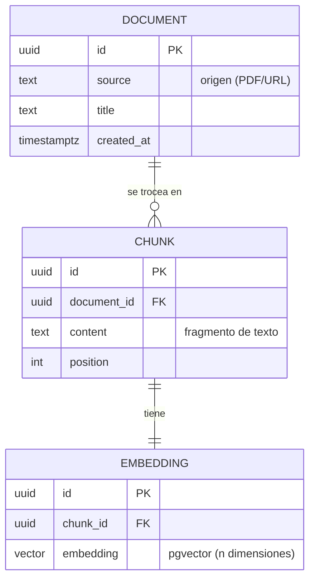
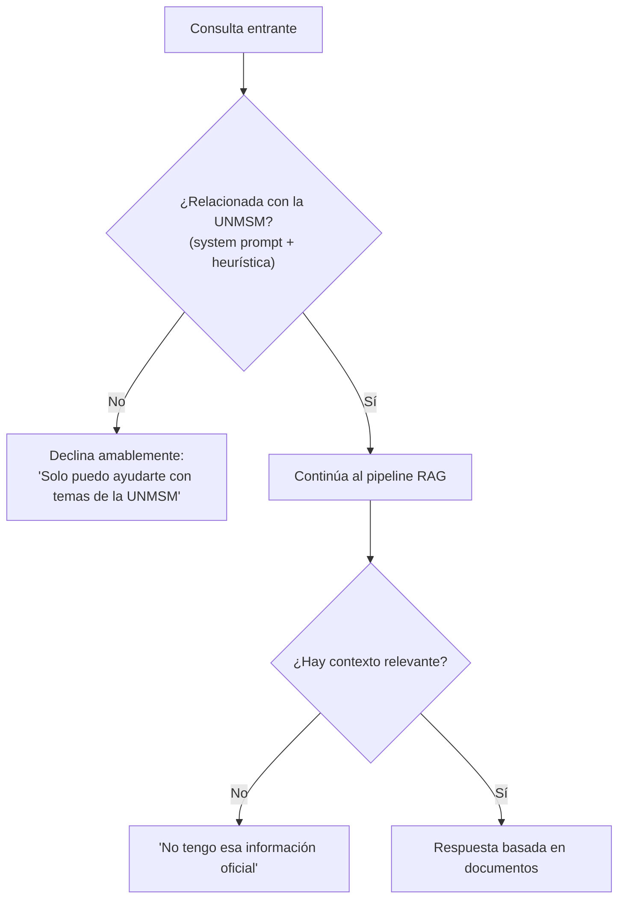

# 3. Backend y RAG

> **Estado:** el backend está **en producción** (`POST /api/chat` desplegado en Render) con **LLM real (Gemini)** y **recuperación semántica con Supabase pgvector** (embeddings Gemini). El modo mock persiste para los tests. Este documento describe la arquitectura conceptual; para el detalle de **lo que existe en el código** y cómo correrlo, ver [07-avance-backend](./07-avance-backend.md).

El asistente responde **solo con información oficial de la UNMSM**. Para lograrlo se usa **RAG (Retrieval-Augmented Generation)**: en vez de dejar que el modelo "invente", primero se **recuperan** fragmentos de documentos institucionales y luego se le pide al LLM que **genere** la respuesta usando ese contexto.

---

## 3.1 ¿Por qué RAG?

| Problema sin RAG                                        | Solución con RAG                                          |
| ------------------------------------------------------- | --------------------------------------------------------- |
| El LLM alucina datos (horarios, oficinas inexistentes). | Las respuestas se anclan a documentos reales (HU-2.2).    |
| El conocimiento del modelo está congelado.              | Se actualiza agregando documentos a la base vectorial.    |
| No hay forma de citar la fuente.                        | Cada respuesta se construye desde fragmentos recuperados. |



---

## 3.2 Arquitectura del backend (FastAPI)



| Componente                  | Responsabilidad                                                                    |
| --------------------------- | ---------------------------------------------------------------------------------- |
| **Routers**                 | Exponen los endpoints HTTP (`/api/chat`, `/health`).                               |
| **Schemas (Pydantic)**      | Validan y tipan request/response.                                                  |
| **Guardrails**              | Aplican el filtro de alcance (léxico + raíces) y el _system prompt_ (HU-2.4).      |
| **Motor RAG propio**        | Recupera contexto y coordina la llamada al LLM.                                    |
| **Embeddings Gemini**       | Convierten texto en vectores (`gemini-embedding-001`, 768 dims) para la búsqueda.  |
| **pgvector**                | Almacena e indexa los embeddings (tabla `documents`, índice HNSW coseno).          |

---

## 3.3 Pipeline de ingesta (offline)

Proceso **previo y periódico** que alimenta la base de conocimiento. No ocurre durante la conversación.



> En el código, `python -m app.rag.ingest_pgvector` reconstruye la base (corpus +
> entradas aprobadas → pgvector). Para sumar lugares del mapa que aún no están en el
> corpus, `find_gaps` redacta borradores anclados (Gemini) y `upload_entries` sube los
> aprobados. Agregar información no cambia la app (objetivo del [Product Vision Board](./06-backlog-y-roadmap.md)).

---

## 3.4 Pipeline de consulta (online, en cada pregunta)



---

## 3.5 Modelo de datos de la base de conocimiento (pgvector)

Esquema mínimo propuesto para Supabase:



> La implementación **aplana** este modelo en **una sola tabla** `documents` con columnas `content`, `metadata (jsonb)` y `embedding (vector(768))`, más la función RPC `match_documents` (similitud coseno, índice HNSW). El esquema real está en `backend/db/schema.sql`; ver [09-pgvector-supabase](./09-pgvector-supabase.md). El diagrama anterior muestra el modelo conceptual.

---

## 3.6 Guardrails (HU-2.4)

Para evitar el uso indebido de la API del LLM, el backend restringe el alcance del asistente:



---

## 3.7 Contrato de la API

| Método | Ruta        | Body                  | Respuesta                                                                              |
| ------ | ----------- | --------------------- | -------------------------------------------------------------------------------------- |
| `POST` | `/api/chat` | `{ "query": string }` | `{ "answer": string, "locations": LocationResult[], "draw_route": bool, "destination": Coordinate? }` |
| `GET`  | `/health`   | —                     | `{ "status": "ok", "service": string, "version": string }`                             |

`LocationResult` (compartido con el frontend, ver [04-modelo-de-datos](./04-modelo-de-datos.md)):

```ts
interface LocationResult {
  id: string; // ej. "rectorado"
  name: string; // ej. "Rectorado"
  schedule?: string; // ej. "Lun–Vie 8:00–17:00"
}
```

### Enrutamiento automático (HU-2.3 — ya en el contrato)

La respuesta **ya** incluye los campos de enrutamiento para consultas de navegación:

```jsonc
{
  "answer": "Te llevo al Rectorado.",
  "locations": [{ "id": "rectorado", "name": "Rectorado" }],
  "draw_route": true,
  "destination": { "latitude": -12.0578, "longitude": -77.084 },
}
```

`draw_route` se activa solo cuando hay intención de navegación **y** un lugar detectado. Falta que el **frontend** consuma `draw_route`/`destination` para cambiar a la pestaña Mapa y trazar el camino. Ver [05-flujos §5.4](./05-flujos.md#54-enrutamiento-automático-chat--mapa).

---

## 3.8 Cómo levantar el backend (referencia)

```bash
cd backend
python -m venv venv
venv\Scripts\activate        # Windows
pip install -r requirements.txt
uvicorn app.main:app --reload
```

> Variables sensibles (URL de Supabase, llave de servicio, API key del LLM) deben ir en variables de entorno del backend, **nunca** en el cliente móvil.
