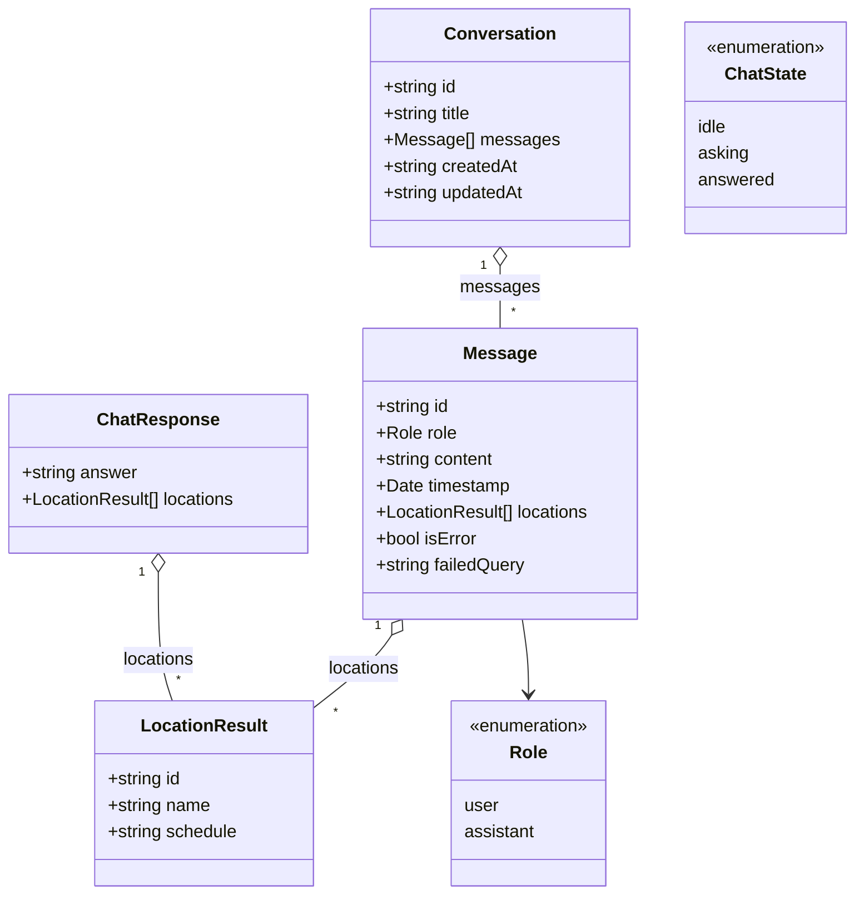
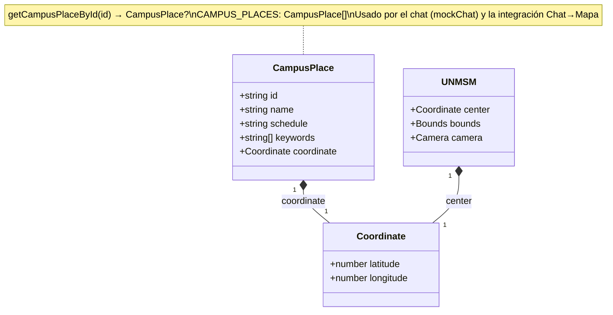
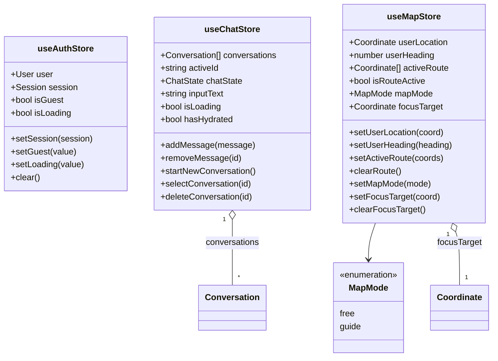
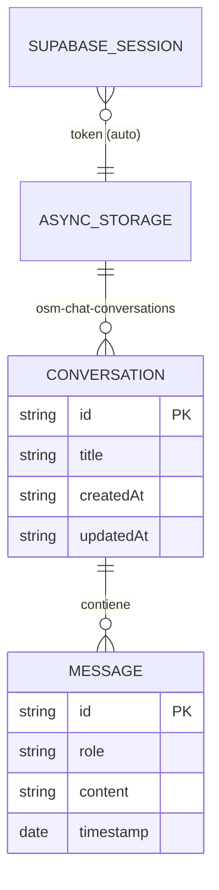

# 4. Modelo de datos

Diagramas de clases del dominio, de los stores de estado (Zustand) y de las entidades persistidas. Todo refleja el código actual en `frontend/src`.

---

## 4.1 Dominio del Chat

Tipos definidos en `src/features/chat/types/index.ts`.

- `ChatResponse` es lo que devuelve `/api/chat` (o el mock). Sus `locations` se copian al `Message` del assistant.
- `failedQuery` guarda la consulta original para el botón **Reintentar**.

---

## 4.2 Dominio del Mapa

Tipos en `src/features/map/constants/unmsm.ts`. `CampusPlace` es el puente entre el chat y el mapa.

> `keywords` permite que `mockChat` empareje consultas sin tildes (ej. "comedor" → Comedor Universitario). `UNMSM_POIS` es un `FeatureCollection` GeoJSON aparte, usado por el render 3D del `MapScreen`.

---

## 4.3 Stores de estado (Zustand)

Los tres stores de `src/core/store/`. El `useChatStore` es el único persistido.

| Store | Persistencia | Clave |
|-------|--------------|-------|
| `useAuthStore` | ❌ (refleja Supabase) | — |
| `useChatStore` | ✅ AsyncStorage | `osm-chat-conversations` (solo `conversations`) |
| `useMapStore` | ❌ | — |

`User` y `Session` provienen de `@supabase/supabase-js`.

---

## 4.4 Entidades persistidas

### Local (dispositivo)

- El **historial del chat** se guarda en AsyncStorage (Zustand `persist`).
- La **sesión de Supabase** también se persiste en AsyncStorage (configurado en `services/supabase/client.ts`), lo que mantiene al usuario logueado entre reinicios.

### Remoto (Supabase)

El esquema de la base de conocimiento (documentos + embeddings con `pgvector`) se detalla en [03-backend-rag §3.5](./03-backend-rag.md#35-modelo-de-datos-de-la-base-de-conocimiento-pgvector). La gestión de usuarios la provee **Supabase Auth** (tabla `auth.users` administrada por Supabase).
