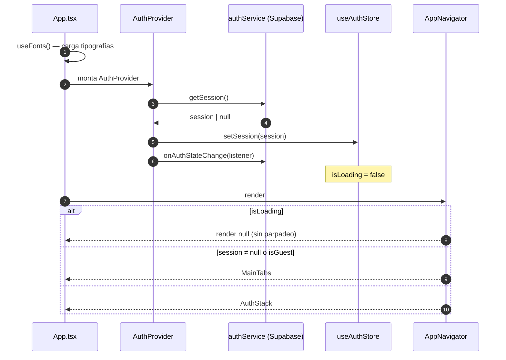
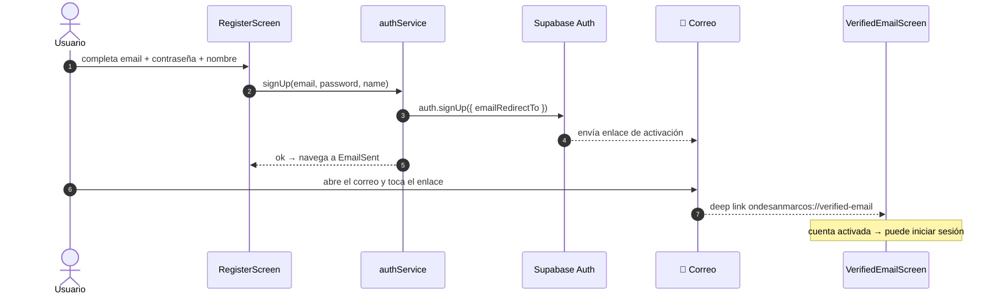
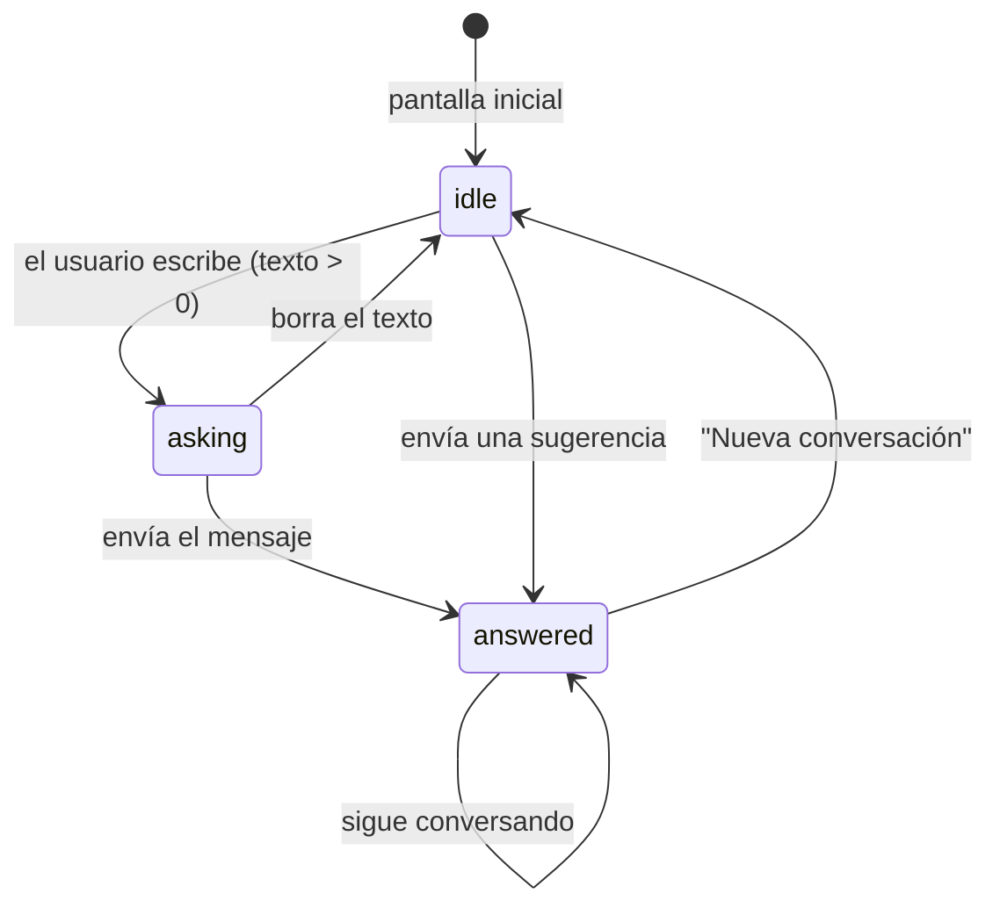
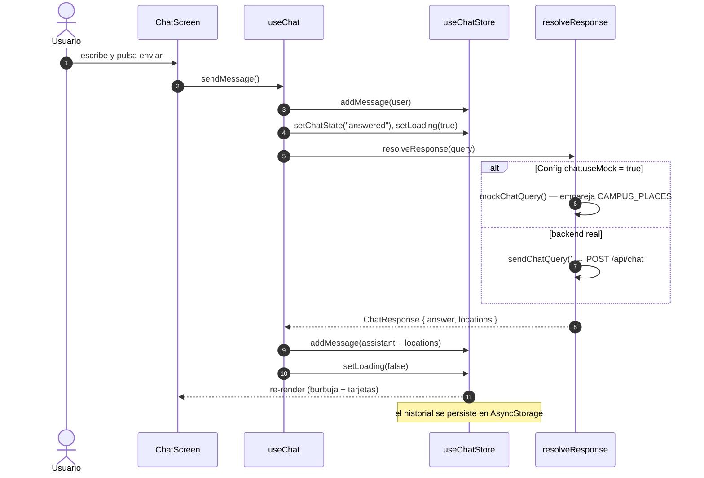
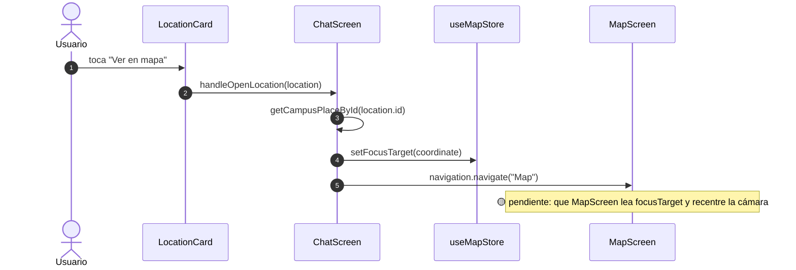
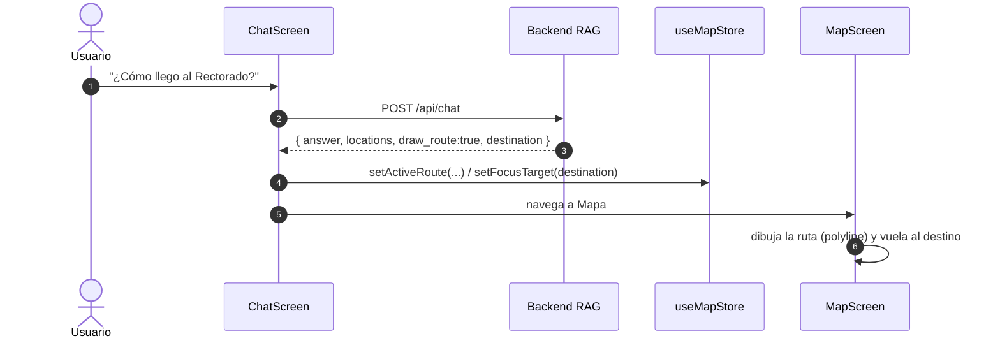
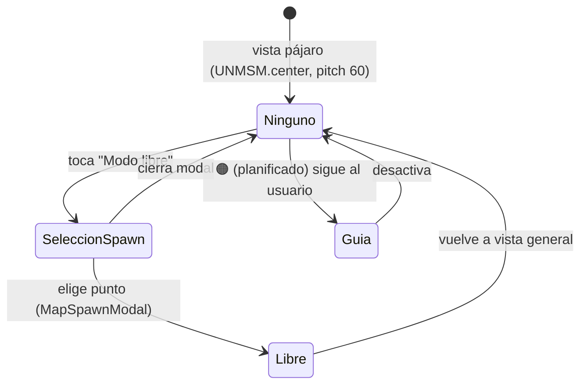
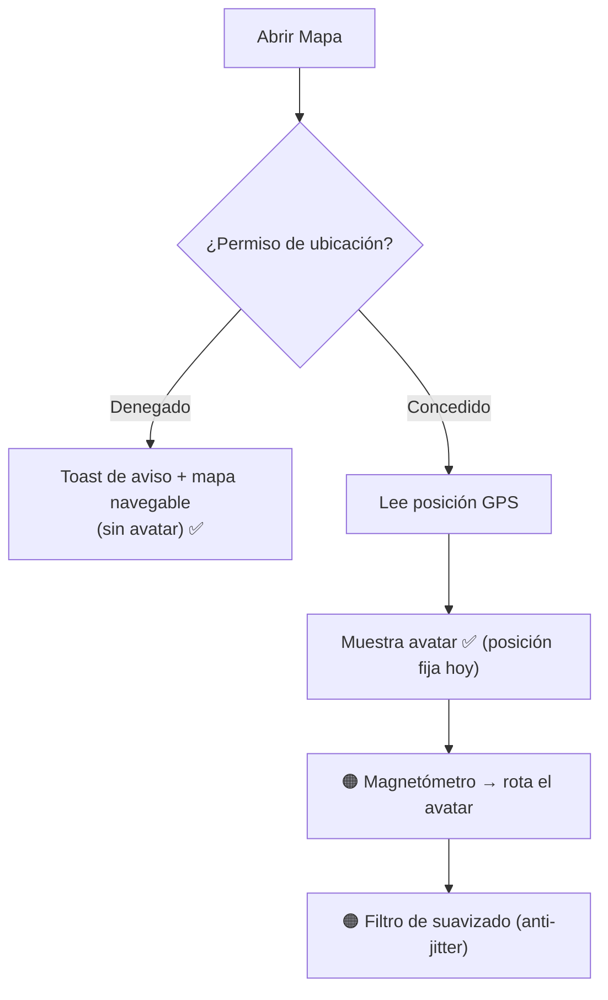

# 5. Flujos

Diagramas de flujo y secuencia de las interacciones principales. Cada flujo indica si está ✅ implementado o 🟠 planificado.

---

## 5.1 Arranque de la app y gating de sesión ✅

Qué ocurre desde que se abre la app hasta que se decide mostrar el login o las pestañas principales.

---

## 5.2 Registro con verificación por correo ✅

Usa **deep linking** (`ondesanmarcos://verified-email`) para que el enlace del correo regrese a la app.

> Si el usuario intenta iniciar sesión sin activar, Supabase rechaza el login (HU-4.2: "Cuenta inactiva").

---

## 5.3 Conversación con el asistente ✅ (mock) · 🟠 (backend)

La pantalla de chat transita entre tres estados visuales. El hook `useChat` decide entre el **mock** y el **backend** según `Config.chat.useMock`.

### Estados de la pantalla

### Secuencia de envío

> Si el backend falla, `useChat` agrega un mensaje de error con `failedQuery` y la UI muestra **Reintentar** (`retryMessage`).

---

## 5.4 Enrutamiento automático (Chat → Mapa) 🟡 / 🟠

### Hoy (parcial ✅/🟡)

Desde una respuesta del asistente, "Ver en mapa" fija el destino y cambia de pestaña.

### Objetivo (HU-2.3 — planificado 🟠)

El propio asistente decide cuándo navegar, devolviendo coordenadas y `draw_route`.

---

## 5.5 Modos de cámara del mapa ✅

`useMapCamera` controla la cámara 3D del campus.

| Modo | Cámara | Estado |
|------|--------|--------|
| **Ninguno** | Vista general desde arriba (zoom 16, pitch 60). | ✅ |
| **Libre** | Inmersión tipo street view (zoom 19.5, pitch 80). | ✅ |
| **Guía** | Sigue la ubicación real del usuario (HU-1.6). | 🟠 |

---

## 5.6 Avatar y orientación (GPS + brújula) 🟠

Flujo previsto para HU-1.1 / HU-1.2 (hoy el avatar se fija al centro del campus si se conceden permisos).

> Las dependencias `expo-location` y `expo-sensors` ya están instaladas; la rotación por magnetómetro y el suavizado son el trabajo pendiente (HU-1.2, Sprint 3).
