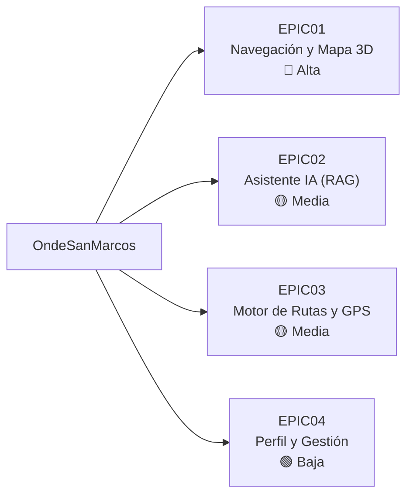
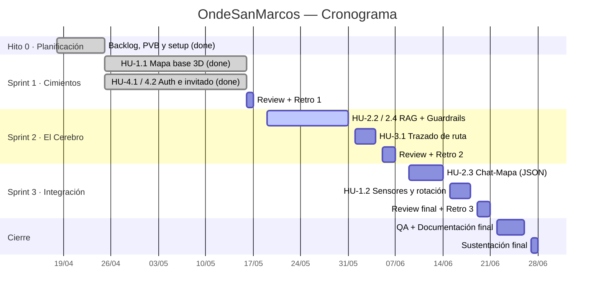

# 6. Backlog y roadmap

Consolida la visión del producto, el backlog (épicas e historias de usuario) y el cronograma. La columna **Estado** mapea cada historia contra lo que **ya existe en el código** a la fecha de este documento (29/05/2026).

> Fuente: *Product Vision Board v1.0* y *Product Backlog v1.1* del equipo. El estado es la lectura del código actual; las historias 🟠 reflejan lo que la documentación dice que **se hará**.

---

## 6.1 Visión del producto

> **Transformar la experiencia de navegación e inducción dentro del campus**, dotando a los estudiantes de una herramienta inteligente y autónoma que elimine la desorientación y democratice el acceso rápido a la información institucional.

| | |
|---|---|
| **Público** | Ingresantes, estudiantes de pre/posgrado, personal administrativo, visitantes y postulantes. |
| **Problema** | Campus grande y confuso; horarios dispersos en PDFs/redes; mapas 2D estáticos; Google Maps desactualizado. |
| **Producto** | Mapa 3D (Mapbox) con avatar en tiempo real, rutas óptimas A→B, y chatbot IA anclado a documentos oficiales (RAG). React Native (Android/iOS) + backend de alto rendimiento. |
| **Valor** | Reducir el tiempo perdido buscando aulas/oficinas; demostrar IA generativa en móvil; arquitectura ampliable agregando documentos a la base vectorial. |

---

## 6.2 Épicas

| Código | Épica | Descripción | Prioridad |
|--------|-------|-------------|-----------|
| EPIC01 | Navegación y Mapa 3D | SDK Mapbox, entorno virtual y avatares. | Alta |
| EPIC02 | Asistente IA (RAG) | Motor conversacional + base vectorial. | Media |
| EPIC03 | Motor de Rutas y GPS | Algoritmos de ruta y geolocalización. | Media |
| EPIC04 | Perfil y Gestión Institucional | Auth, preferencias y base de conocimiento. | Baja |

---

## 6.3 Historias de usuario y estado

**Leyenda:** ✅ Implementado · 🟡 Parcial · 🟠 Planificado

### EPIC01 — Navegación y Mapa 3D

| HU | Nombre | Prioridad | Est. | Estado | Evidencia en código |
|----|--------|-----------|------|--------|---------------------|
| HU-1.1 | Permisos y Visualización Base | Alta | 5 | ✅ | `MapScreen` carga centrado en UNMSM; pide permiso; avatar si se concede. |
| HU-1.2 | Avatar con Rotación Real | Media | 8 | 🟠 | `expo-sensors` instalado; falta magnetómetro + suavizado. |
| HU-1.3 | Búsqueda de ubicaciones | Media | 5 | 🟡 | `MapSearchBar` existe; falta lógica de sugerencias/centrado. |
| HU-1.4 | Indicador de ubicación actual | Media | 5 | 🟡 | `MapLocationButton` existe; falta precisión/centrado real. |
| HU-1.5 | Modo libre (street view) | Media | 8 | ✅ | `useMapCamera.goToFreeMode` + `MapSpawnModal`. |
| HU-1.6 | Modo guía | Alta | 8 | 🟠 | Modo definido en cámara; falta seguimiento en tiempo real. |

### EPIC02 — Asistente IA (RAG)

| HU | Nombre | Prioridad | Est. | Estado | Evidencia en código |
|----|--------|-----------|------|--------|---------------------|
| HU-2.1 | Interfaz de Chat Dedicada | Alta | 5 | ✅ | Pestaña "Asistente", `ChatScreen`, burbujas, input. |
| HU-2.2 | Consultas RAG (Base de Conocimiento) | Alta | 13 | 🟡 | Backend `/api/chat` desplegado con **LLM real (Gemini)** sobre **corpus oficial**; recuperación local, pgvector + embeddings pendientes. Ver [07-avance-backend](./07-avance-backend.md). |
| HU-2.3 | Enrutamiento Automático (Chat-Mapa) | Alta | 8 | 🟡 | Backend ya devuelve `draw_route` + `destination`; falta que el frontend lo consuma y trace la ruta. |
| HU-2.4 | Filtro de Contexto (Guardrails) | Alta | 3 | ✅ | Guardrails de alcance UNMSM por límite de palabra + system prompt (heurística implementada y con pruebas); se reforzará con el LLM real. |
| HU-2.5 | Sugerencias de preguntas | Media | 3 | ✅ | `SuggestionChips` en `ChatScreen`. |
| HU-2.6 | Respuestas enriquecidas | Media | 5 | ✅ | `LocationCard` con botón "Ver en mapa". |

### EPIC03 — Motor de Rutas y GPS

| HU | Nombre | Prioridad | Est. | Estado | Evidencia en código |
|----|--------|-----------|------|--------|---------------------|
| HU-3.1 | Trazado de Ruta (A→B) | Alta | 8 | 🟠 | `src/features/routing/` vacío; `LineLayer` existe para render. |
| HU-3.2 | Instrucciones paso a paso | Alta | 8 | 🟠 | Pendiente. |
| HU-3.3 | Selección rápida de destino frecuente | Media | 5 | 🟠 | Pendiente. |

### EPIC04 — Perfil y Gestión Institucional

| HU | Nombre | Prioridad | Est. | Estado | Evidencia en código |
|----|--------|-----------|------|--------|---------------------|
| HU-4.1 | Ingreso como Invitado | Alta | 3 | ✅ | `isGuest` en `useAuthStore` + gating. |
| HU-4.2 | Registro y Activación | Alta | 8 | ✅ | `authService.signUp` + deep link de verificación. |
| HU-4.3 | Inicio de sesión | Alta | 5 | ✅ | `authService.signIn` + `LoginScreen`. |
| HU-4.4 | Preferencias del usuario | Media | 5 | 🟡 | `ProfileScreen` + `SettingsItem`; falta persistir/temas. |

---

## 6.4 Cronograma (Scrum)

Enfoque **SCRUM**, 3 sprints. Inicio **18/04/2026** — Fin **28/06/2026**.

| Hito | Periodo | Estado |
|------|---------|--------|
| Hito 0 — Planificación | 18/04 – 25/04 | ✅ Realizado |
| Hito 1 — Fin Sprint 1 | 25/04 – 17/05 | 🟡 En cierre |
| Hito 2 — Fin Sprint 2 | 18/05 – 07/06 | 🟠 En curso |
| Hito 3 — Fin Sprint 3 | 08/06 – 21/06 | 🟠 Pendiente |
| Hito 4 — Proyecto Final | 22/06 – 28/06 | 🟠 Pendiente |

---

## 6.5 Próximos pasos sugeridos

1. **Cerrar la integración Chat→Mapa** (HU-2.3 parcial): que `MapScreen` lea `focusTarget` y recentre la cámara.
2. **Completar el backend RAG** (HU-2.2): el LLM real (Gemini) ya corre en producción sobre el corpus oficial (ver [07-avance-backend](./07-avance-backend.md)); falta la recuperación real con pgvector + embeddings y, en el frontend, apagar `EXPO_PUBLIC_USE_MOCK_CHAT`.
3. **Motor de rutas** (EPIC03): poblar `src/features/routing/` y trazar `polyline` A→B.
4. **Sensores del avatar** (HU-1.2): magnetómetro + filtro de suavizado.
