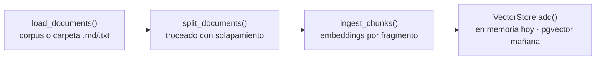

# 7. Avance del backend RAG

> **Propósito:** guía viva del backend del asistente. Registra **qué se ha
> construido**, cómo correrlo y cómo evolucionarlo. Complementa el diseño
> objetivo del [03-backend-rag](./03-backend-rag.md): aquí está lo que **ya
> existe en el código**.
>
> Última actualización: **04/07/2026** (LLM real Gemini + corpus oficial en producción).

---

## 7.1 Resumen del estado

El backend está **desplegado con LLM real (Gemini)** sobre el **corpus oficial**
del campus: `POST /api/chat` devuelve respuestas naturales ancladas a documentos
verificados. La recuperación es **local** (bag-of-words sobre el corpus);
Supabase + pgvector siguen pendientes. El modo mock persiste para los tests
(hermético, sin red).

| Historia | Estado | Qué se hizo |
|----------|--------|-------------|
| **HU-2.2** Consultas RAG | 🟡 Parcial | LLM real (**Gemini**) en producción sobre **corpus oficial** (37 lugares + 41 documentos desde el documento verificado del campus). Recuperación local; **pgvector + embeddings neuronales pendientes**. |
| **HU-2.4** Guardrails | ✅ (heurística) | Filtro de alcance UNMSM por límite de palabra + system prompt para el LLM real. |
| **HU-2.3** Enrutamiento | 🟡 Parcial | El contrato ya devuelve `draw_route` + `destination`; el motor detecta intención de navegación. Falta que el frontend lo consuma. |

**Leyenda:** ✅ Implementado · 🟡 Parcial · 🟠 Planificado

---

## 7.2 Arquitectura del código

```
backend/app/
├── main.py              # App FastAPI: /health, CORS, handler de errores 503
├── config.py            # Settings (env): modo mock, top-k, troceado, llaves
├── api/chat.py          # Endpoint POST /api/chat
├── schemas/chat.py      # Contrato: ChatRequest, ChatResponse, Coordinate, ...
├── knowledge/
│   ├── corpus.py        # Corpus oficial del campus (derivado de sources/unmsm_info.md)
│   ├── places.py        # Lugares del campus (espejo de CAMPUS_PLACES del front)
│   └── sources/         # Documento oficial verificado (fuente única del corpus)
└── rag/
    ├── engine.py        # Orquestador RAG (guardrails → recuperar → generar)
    ├── guardrails.py    # Filtro de alcance institucional (HU-2.4)
    ├── intent.py        # Detección de intención de navegación (HU-2.3)
    ├── ingestion.py     # Pipeline de ingesta (carga, troceado, embeddings)
    ├── retriever.py     # Indexa por fragmentos y recupera top-k por coseno
    ├── embeddings.py    # EmbeddingProvider (mock: bag-of-words)
    ├── vector_store.py  # InMemoryVectorStore (mock de pgvector)
    ├── llm.py           # LLMProvider (mock + Gemini/OpenAI/Anthropic reales)
    └── providers.py     # Selecciona implementaciones mock vs reales
```

Toda pieza intercambiable está detrás de una interfaz (`EmbeddingProvider`,
`LLMProvider`, almacén con `add`/`search`), de modo que pasar de mock a real es
sustituir la implementación, no reescribir el motor.

---

## 7.3 El pipeline de ingesta (HU-2.2)

Implementa el flujo offline del [§3.3](./03-backend-rag.md#33-pipeline-de-ingesta-offline).
Vive en `app/rag/ingestion.py`:



- `chunk_text(text, chunk_size, overlap)` trocea respetando límites de palabra
  y manteniendo solapamiento (no se pierde contexto en las fronteras).
- El `Retriever` indexa **a nivel de fragmento** y al recuperar colapsa al
  documento padre quedándose con el mejor puntaje.
- `load_documents(dir)` puede leer documentos reales desde una carpeta
  (`.md`/`.txt`); si no se indica, usa el corpus en código.

---

## 7.4 Selección de proveedores (mock vs real)

`app/rag/providers.py` decide las implementaciones según `config`:

| `RAG_USE_MOCK` | Supabase configurado | LLM | Recuperación |
|----------------|----------------------|-----|--------------|
| `true` (tests) | — | `TemplateLLM` (determinista) | corpus + bag-of-words en memoria |
| `false` (**producción**) | no | **Gemini** (u OpenAI/Anthropic) real | **local** (bag-of-words) sobre los documentos fuente |
| `false` | sí | Gemini/OpenAI/Anthropic real | pgvector → **pendiente** (lanza `RagProviderError` con instrucciones) |

Si falta una llave o una dependencia opcional, se lanza `RagProviderError` con
un mensaje accionable; el endpoint lo traduce a **HTTP 503** (no 500) para que
el frontend muestre "Reintentar".

---

## 7.5 Contrato `/api/chat` (con enrutamiento, HU-2.3)

```jsonc
// POST /api/chat   →   { "query": "¿cómo llego al rectorado?" }
{
  "answer": "El Rectorado es la sede de la administración central... Te guío a Rectorado: trazo la ruta en el mapa.",
  "locations": [ { "id": "rectorado", "name": "Rectorado", "schedule": "Lun–Vie 8:00–17:00" } ],
  "draw_route": true,
  "destination": { "latitude": -12.0578, "longitude": -77.084 }
}
```

- `draw_route` se activa solo cuando hay **intención de navegación** ("cómo
  llego", "llévame a", "ruta a"…) **y** se detecta un lugar.
- Una pregunta normal sobre un lugar (p. ej. "¿a qué hora abre la biblioteca?")
  devuelve `draw_route: false` y `destination: null`.

---

## 7.6 Cómo correrlo

> Requiere **Python 3.11+**. El modo mock no necesita llaves ni dependencias
> pesadas.

```bash
cd backend
python -m venv .venv
.venv\Scripts\activate            # Windows (en bash/zsh: source .venv/bin/activate)
pip install -r requirements.txt
uvicorn app.main:app --reload     # API en http://localhost:8000
```

Pruebas:

```bash
pytest -q                         # batería completa (modo mock, sin red)
```

Probar el endpoint:

```bash
curl -X POST http://localhost:8000/api/chat ^
  -H "Content-Type: application/json" ^
  -d "{\"query\": \"como llego al rectorado\"}"
```

---

## 7.7 Activar proveedores reales

1. Instala el SDK del LLM: `pip install -r requirements-llm.txt` (Gemini). Para
   OpenAI/Anthropic usa `requirements-rag.txt`.
2. Copia `.env.example` a `.env` y completa (así corre en producción hoy):
   ```ini
   RAG_USE_MOCK=false
   LLM_PROVIDER=gemini          # o openai / anthropic
   LLM_API_KEY=...              # NUNCA subir al repo (.env está en .gitignore)
   LLM_MODEL=gemini-2.5-flash   # opcional
   ```
3. Sin `SUPABASE_*`, la recuperación es **local** (es lo que corre hoy en el
   deploy). Con `SUPABASE_*`, se lanza un error explicando los pasos de pgvector
   (siguiente sección).

---

## 7.8 Próximos pasos

1. **pgvector real** (`_build_pgvector_retriever` en `providers.py`): crear la
   tabla `documents(content, metadata jsonb, embedding vector)` en Supabase,
   poblarla con el pipeline de ingesta y un almacén que consulte por similitud.
2. **Embeddings reales** (modelo neuronal vía LlamaIndex) en vez de bag-of-words.
3. **Consumo del enrutamiento en el frontend**: leer `draw_route`/`destination`
   en el chat y trazar la `polyline` en el mapa (cierra HU-2.3).

> ✅ Ya hecho: **corpus oficial real** (desde `sources/unmsm_info.md`) y **LLM
> real (Gemini)** activo en producción.
