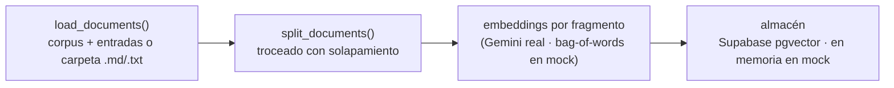

# 7. Avance del backend RAG

> **Propósito:** guía viva del backend del asistente. Registra **qué se ha
> construido**, cómo correrlo y cómo evolucionarlo. Complementa el diseño
> objetivo del [03-backend-rag](./03-backend-rag.md): aquí está lo que **ya
> existe en el código**.
>
> Última actualización: **07/07/2026** (LLM real Gemini + recuperación con pgvector en producción; frontend cableado).

---

## 7.1 Resumen del estado

El backend está **desplegado con LLM real (Gemini `gemini-2.5-flash`)** sobre el
**corpus oficial** del campus y **recuperación semántica con pgvector** (Supabase +
embeddings Gemini `gemini-embedding-001`, 768 dims, coseno HNSW): `POST /api/chat`
devuelve respuestas naturales ancladas a documentos verificados. Si Supabase no está
configurado, cae con gracia a recuperación **local** (bag-of-words). El **frontend ya
consume este backend por defecto**. El modo mock persiste para los tests (hermético,
sin red).

| Historia | Estado | Qué se hizo |
|----------|--------|-------------|
| **HU-2.2** Consultas RAG | ✅ | LLM real (**Gemini**) sobre **corpus oficial** (37 lugares + 41 documentos) y **recuperación semántica con pgvector** (embeddings Gemini). Fallback local sin Supabase. |
| **HU-2.4** Guardrails | ✅ (heurística) | Filtro de alcance UNMSM por léxico + raíces del dominio + system prompt para el LLM real. |
| **HU-2.3** Enrutamiento | 🟡 Parcial | El contrato ya devuelve `draw_route` + `destination`; el motor detecta intención de navegación. Falta que el **frontend** lo consuma y trace la ruta. |

**Leyenda:** ✅ Implementado · 🟡 Parcial · 🟠 Planificado

---

## 7.2 Arquitectura del código

```
backend/app/
├── main.py              # App FastAPI: /health, CORS, handler de errores 503
├── config.py            # Settings (env): modo mock, top-k, troceado, llaves
├── api/chat.py          # Endpoint POST /api/chat
├── schemas/chat.py      # Contrato: ChatRequest, ChatResponse, Coordinate, ...
├── knowledge/
│   ├── corpus.py        # Corpus oficial del campus (41 docs desde sources/unmsm_info.md)
│   ├── places.py        # Lugares del campus (37, espejo de CAMPUS_PLACES del front)
│   ├── entries.py       # Modelo de entradas aprobadas (respaldo versionado del conocimiento)
│   ├── entries/         # JSON de entradas revisadas (gaps_review.json)
│   └── sources/         # Documento oficial verificado (fuente única del corpus)
└── rag/
    ├── engine.py            # Orquestador RAG (guardrails → recuperar → generar)
    ├── guardrails.py        # Filtro de alcance institucional: léxico + raíces (HU-2.4)
    ├── intent.py            # Detección de intención de navegación (HU-2.3)
    ├── ingestion.py         # Pipeline de ingesta (carga, troceado, embeddings)
    ├── retriever.py         # Indexa por fragmentos y recupera top-k por coseno (local/mock)
    ├── pgvector.py          # PgVectorRetriever real (Supabase, RPC match_documents)
    ├── embeddings.py        # EmbeddingProvider (mock bag-of-words + Gemini real)
    ├── vector_store.py      # InMemoryVectorStore (usado por el retriever mock)
    ├── llm.py               # LLMProvider (mock + Gemini/OpenAI/Anthropic reales)
    ├── providers.py         # Selecciona implementaciones mock vs reales
    ├── ingest_pgvector.py   # Ingesta offline: corpus + entradas → Supabase pgvector
    ├── find_gaps.py         # Detecta lugares del mapa sin descripción, redacta borradores (Gemini)
    └── upload_entries.py    # Sube entradas aprobadas a Supabase
```

Toda pieza intercambiable está detrás de una interfaz (`EmbeddingProvider`,
`LLMProvider`, un retriever con `retrieve`), de modo que pasar de mock a real es
sustituir la implementación, no reescribir el motor.

---

## 7.3 El pipeline de ingesta (HU-2.2)

Implementa el flujo offline del [§3.3](./03-backend-rag.md#33-pipeline-de-ingesta-offline).
Vive en `app/rag/ingestion.py`:



- `chunk_text(text, chunk_size, overlap)` trocea respetando límites de palabra
  y manteniendo solapamiento (no se pierde contexto en las fronteras).
- El `Retriever` indexa **a nivel de fragmento** y al recuperar colapsa al
  documento padre quedándose con el mejor puntaje.
- `load_documents(dir)` puede leer documentos reales desde una carpeta
  (`.md`/`.txt`); si no se indica, usa el corpus en código.

---

## 7.4 Selección de proveedores (mock vs real)

`app/rag/providers.py` decide las implementaciones según `config`:

| `RAG_USE_MOCK` | Supabase configurado | LLM | Recuperación |
|----------------|----------------------|-----|--------------|
| `true` (tests) | — | `TemplateLLM` (determinista) | corpus + bag-of-words en memoria |
| `false` | no | **Gemini** (u OpenAI/Anthropic) real | **local** (bag-of-words) sobre los documentos fuente |
| `false` (**producción**) | sí | Gemini/OpenAI/Anthropic real | **Supabase pgvector** + embeddings Gemini (RPC `match_documents`) |

Si falta una llave o una dependencia opcional, se lanza `RagProviderError` con
un mensaje accionable; el endpoint lo traduce a **HTTP 503** (no 500) para que
el frontend muestre "Reintentar".

---

## 7.5 Contrato `/api/chat` (con enrutamiento, HU-2.3)

```jsonc
// POST /api/chat   →   { "query": "¿cómo llego al rectorado?" }
{
  "answer": "El Rectorado es la sede de la administración central... Te guío a Rectorado: trazo la ruta en el mapa.",
  "locations": [ { "id": "rectorado", "name": "Rectorado", "schedule": "Lun–Vie 8:00–17:00" } ],
  "draw_route": true,
  "destination": { "latitude": -12.0578, "longitude": -77.084 }
}
```

- `draw_route` se activa solo cuando hay **intención de navegación** ("cómo
  llego", "llévame a", "ruta a"…) **y** se detecta un lugar.
- Una pregunta normal sobre un lugar (p. ej. "¿a qué hora abre la biblioteca?")
  devuelve `draw_route: false` y `destination: null`.

---

## 7.6 Cómo correrlo

> Requiere **Python 3.11+**. El modo mock no necesita llaves ni dependencias
> pesadas.

```bash
cd backend
python -m venv .venv
.venv\Scripts\activate            # Windows (en bash/zsh: source .venv/bin/activate)
pip install -r requirements.txt
uvicorn app.main:app --reload     # API en http://localhost:8000
```

Pruebas:

```bash
pytest -q                         # batería completa (modo mock, sin red)
```

Probar el endpoint:

```bash
curl -X POST http://localhost:8000/api/chat ^
  -H "Content-Type: application/json" ^
  -d "{\"query\": \"como llego al rectorado\"}"
```

---

## 7.7 Activar proveedores reales

1. Instala los SDKs: `pip install -r requirements-llm.txt` (Gemini) y
   `pip install -r requirements-pgvector.txt` (cliente `supabase`). Para
   OpenAI/Anthropic usa `requirements-rag.txt`.
2. Copia `.env.example` a `.env` y completa (así corre en producción hoy):
   ```ini
   RAG_USE_MOCK=false
   LLM_PROVIDER=gemini          # o openai / anthropic
   LLM_API_KEY=...              # NUNCA subir al repo (.env está en .gitignore)
   LLM_MODEL=gemini-2.5-flash   # opcional
   SUPABASE_URL=...             # activa la recuperación con pgvector
   SUPABASE_SERVICE_KEY=...     # secreto (service_role)
   ```
3. Con `SUPABASE_*` definidos, la recuperación usa **pgvector + embeddings Gemini**
   (hay que poblar la base con `python -m app.rag.ingest_pgvector`, ver
   [09-pgvector-supabase](./09-pgvector-supabase.md)). Sin `SUPABASE_*`, cae con
   gracia a la recuperación **local** (bag-of-words).

---

## 7.8 Próximos pasos

1. **Consumo del enrutamiento en el frontend**: leer `draw_route`/`destination`
   en el chat y trazar la `polyline` en el mapa (cierra HU-2.3).
2. **Ampliar el corpus**: cerrar los gaps de lugares del mapa con
   `find_gaps`/`upload_entries` (respaldo versionado en `app/knowledge/entries/`).

> ✅ Ya hecho: **corpus oficial real** (desde `sources/unmsm_info.md`), **LLM real
> (Gemini)**, **recuperación semántica con embeddings + pgvector** (Supabase, ver
> [`09-pgvector-supabase.md`](./09-pgvector-supabase.md)), **umbral recalibrado**
> para embeddings densos (`RAG_SCORE_THRESHOLD=0.55`) y **frontend cableado** al
> backend. Cierra el grueso de HU-2.2.
